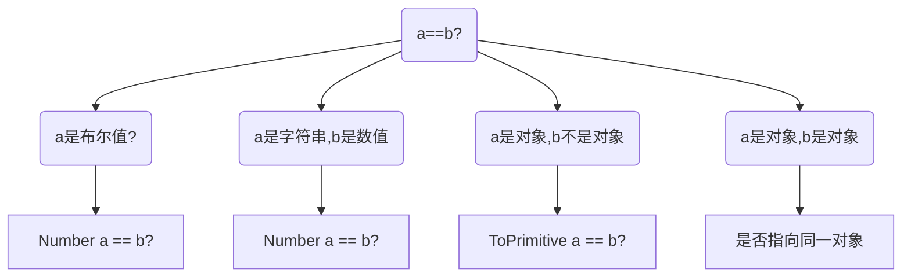
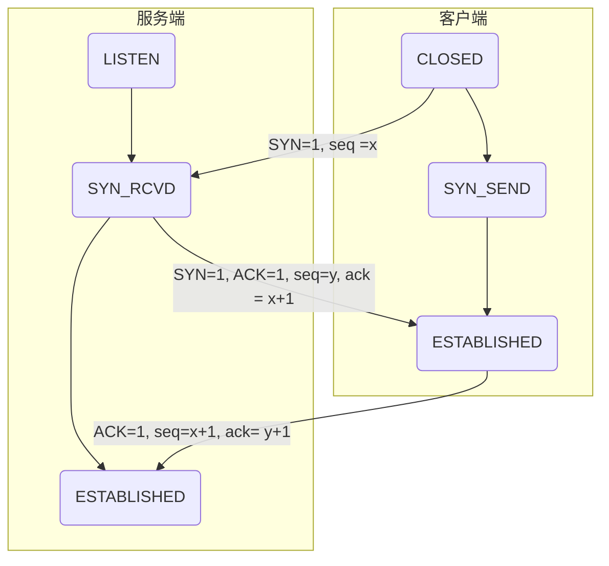
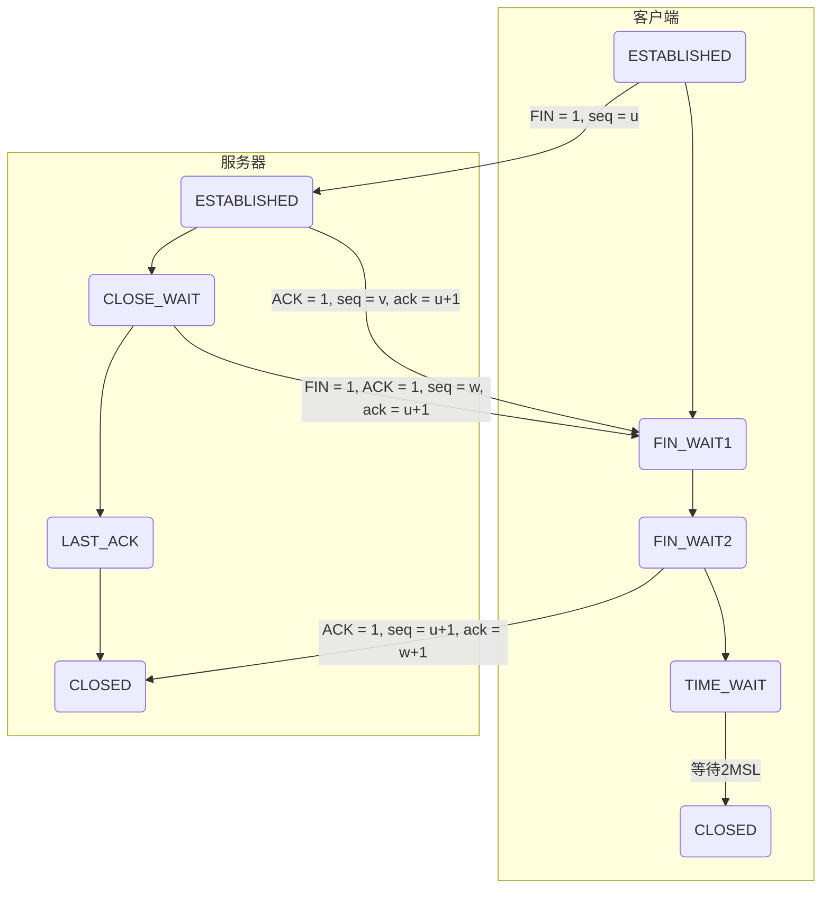

### 1. TCP,UDP区别

| TCP                | UDP                |
| ------------------ | ------------------ |
| 基于有连接         | 基于无连接         |
| 对系统资源要求较多 | 对系统资源要求少   |
| 程序比较复杂       | 程序结构比较简单   |
| 流模式             | 数据报模式         |
| 保证数据的准确性   | 不保证数据的准确性 |
| 保证数据的顺序     | 不保证数据的顺序   |


### 2. OSI七层模型以及tcp/ip四层模型

| OSI七层模型 | tcp/ip四层模型 | 常用的5层模型    |
| ----------- | -------------- | ---------------- |
| 物理层      | 物理层         | 物理层           |
| 数据链路层  | 数据层         | 数据链路层       |
| 网络层      | 网络层         | 网络层(IP)       |
| 传输层      | 应用层         | 传输层(TCP/UDP)  |
| 会话层      |                | 应用层(HTTP协议) |
| 表示层      |                |                  |
| 应用层      |                |                  |

### 3. Web前端应该从哪些方面来优化网站

- 页面级别优化
  - 资源合并
  - 减少请求次数
  - 图片懒加载
  - 图片合并压缩
  - 脚本后置
  - css前置
  - inline脚本defer
  - 域名配置时防止发生跳转
  - 避免重复打包模块代码
- 代码级别优化
  - 减少dom操作,virtual-dom的目标
    - vue、 React底层优化
  - css减少回流
    - 根据viewport和渲染树,进行几何位置的计算
    - 重绘: 是根据回流产生的几何位置和渲染树进行渲染.
    - 回流一定重绘,重绘不一定回流
  - 避免使用eval和Function
  - 减少作用域链的查找
    - jquery源码,一开始使用一个立即执行函数,将window和undefined传入到函数中,减少作用域链的查找
  - CSS选择符,浏览器对选择符的解析是从右往左进行的

### 4. 从输入URL到页面加载的过程

1. 从浏览器接收到url到开启网络请求线程(这一部分开以展开浏览器的机制以及进程与线程之间的关系)
2. 开启网络线程到发出一个完整的http请求(这一部分涉及DNF查询,tcp/ip请求,五层因特网协议栈等知识)
3. 从服务器接收到请求到对后台接收到请求(这一部分涉及到负载均衡,安全拦截以及后台内部的处理等等)
4. 后台和前台的http交互(这一部分包括http头部、响应码、报文结构、cookie等知识,开源提下静态资源的cookie优化,以及编码,如gzip压缩等)
5. 单独拎出来的缓存问题,http的缓存(这部分包括http缓存头部,etag,catch-control等)
6. 浏览器接收到http数据包的解析流程
   - 词法分析: 将html结构解析成dom树
   - 将css解析成css规则树
   - 合并DOM树和CSS规则树为一棵Render树
   - 然后回流: 根据渲染树计算出渲染树在视口(viewport)中的几何位置
   - 重绘: 根据渲染树和几何信息计算出准确位置之后交付给GPU进行绘制

7. CSS的可视化格式模型(元素的渲染规则,如包含块、控制框,BFC,IFC等概念)

8. JS引擎解析过程(JS的解析阶段,预处理阶段,执行阶段生成执行上下文,VO,作用域链,回收机制等等)

9. 其他(可以扩展不同的知识模块,如跨域、web安全,hybird模式等内容)

   - 常见的三种跨域:

     - 跨域: 浏览器处于安全考虑对非同源的js代码进行限制

     - jsonp: 将回调函数的名称放到url请求地址中,利用script标签的src属性不受浏览器请求的限制的特性.事先客户端与服务器端的跨域

     - CORS: 跨域资源共享技术,在服务端设置: `Access-Control-Access-Origin`和`Access-Control-Allow-Method: "get,post"`即可

       ```js
       // 在express中使用路由守卫,设置返回头部
       app.use((req, res, next)=>{
           res.setHeader('Access-Control-Allow-Oring', '*');
           res.setHeader('Access-Control-Allow-Method': 'get, post')
       })
       ```

     - 使用服务器代理: 简单来说,就是浏览器会限制非同源的js代码,但是服务器之间的交互是不会的.可以在本地的前端设置一个本地的服务器与非同源的服务器进行交互,然后将数据返回个前端.这样就不会产生跨域了.

       ```js
       // 使用express实现本地的代理
       // npm i request
       const express = require('express');
       const app = express();
       const request = require('request');
       // 监听本域的路由
       app.get('/proxy',(req, res)=>{
       	// 请求其他域的路由 
           request('http://www.google.com', function(error, response, body){
               res.send(body);
           })
       })
       app.listen(3000);
       ```

       

### 5. 如何在web端事先异步请求结果的复用,既只产生一次ajax请求并保证所有调用方法获取到数据

1. 较好的回答是: 缓存一个Promise对象,所有调用方注册then函数
2. localstorage(localstorage是否进程安全)
3. 使用单例模式进行封装

### 6. 文件上传如何做断电续传 / 大文件上传(了解)

- file reader: 文件分割
- localStorage: 存储上传信息

要点:

- 前端: 需要获取文件的大小,去计算总分片数,并且需要校验文件的合法性,在上传过程中,需要即时的获取到当前传输文件的当前分片数,以更新下次一需要传输文件的范围大小;
- 服务端, 需要根据前端传入的参数,去确定分析所属的源文件,并追加

### 7.http2.0了解多少

1. `延迟降低`: 针对HTTP高延迟的问题,SPDY优雅的采取了多路复用(multiplexing).多路复用通过多个stream共享一个tcp连接的方式,解决了HOL blocking的问题,降低了延迟同时提高了带宽的利用率
2. `请求优先级(request prioritization)`: 多路复用带来一个新的问题是,在连接共享的基础上有可能会导致关键请求被阻塞.SPDY允许给每个request设置优先级,这样重要的请求就会优先得到响应.比如浏览器加载首页,首页的html内容应该优先展示,之后才是各种静态资源文件,脚本文件等加载,这样可以保证用户能第一时间看到页面内容
3. `header压缩`: 前端提到HTTP1.x的header很多时候都是重复多余的.选择合适的压缩算法可以减少包的大小和数量
4. `基于https的加密协议传输`: 大大提高了传输数据的可靠性
5. `服务器推送(server push)`: 采用了SPDY的网页,例如我的网页有一个style.css的请求,在客户端收到style.css数据的同时,服务端会将style.js嗯等文件推送给客户端,当客户端再次尝试获取style.js时就可以直接从缓存中获取到,不用再发送请求了.

### 8. HTTP2.0的多路复用和HTTP1.X中的长连接复用有什么区别?

- `HTTP/1.`一次请求-响应,建立一个连接,用完关闭;吗每个请求都要建立一个连接
- `HTTP/1.1`Pipeline解决方式,若个个请求排队串行化单线程处理,后面的请求等待前面请求的返回才能获得执行机会,一旦有某些请求超时等,后续请求只能被阻塞(线头阻塞)
- `HTTP/2`多个请求可同时再一个链接上并行执行。某个请求任务耗时严重,不会影响其他连接的正常执行

### 9. 你觉得http3.0用UDP协议会有什么好处和坏处

- 丢包重发需要确认,浪费至少一个ttfb
- 对连接中断的感知会比tcp慢
- 丢包不影响后续数据传输


### 10. http缓存协议头部字段

- `Cache-Control`: 响应头表示资源是否可以被缓存,以及缓存的有效期
- `Last-Modified`: 表示文件修改时间,请求头为
- `If-Modified-Since`：表示上次文件修改的时间
- `Etag`: 表示文件版本,`If-None-Match`: 表示上次下载文件的Etag

### 11. Etag和Last-Modified区别

1. `Last-Modifiled`只能精确到秒,秒之间的内容更新Etag才能检测
2. 文件有时会定时重新生成相同内容,`Last-Modified`不能很好辨别
3. etag每次服务端生成都需要进行读写操作,而last-modified只需要读取操作,etag的消耗更大

### 12. defer和async的区别

- `defer`要等到整个页面再内存中正常渲染结束(DOM结构完全生成,以及其他脚本执行完成)才会执行,多个defer脚本会按照它们再页面出现的顺序加载("渲染完再执行")
- async一旦下载完成,渲染引擎就会中断渲染,执行这个脚本后,再继续渲染.多个async脚本是不能保证加载顺序的

【注】: 普通的script标签再请求的时候就被阻塞了,而defer和async再请求的时候不会被阻塞

### 13. es6 module, commonjs, cmd, amd区别

1. 说出cmd/amd的区别,引用依赖模块方式
2. 说出es6 module和commonjs的区别

commonJS模块输出的是一个值的拷贝,ES6模块输出的是值得引用.运行时加载,ES6模块是编译时输出接口.ES6模块的设计思想是尽量静态化,使得编译时就能确定模块的依赖关系

### 14. xss和csrf攻击原理,防御方法...

### 15. loadmore.js实现

### 16. Dom中Property和Attribute的区别

- property是DOM中的属性,是JavaScript里的对象
- attribute是HTML标签上的特性,它的值只能够是字符串

### 17. 为什么[] ==(![]) 为true



### 18. reverse反转字符串

```js
let str1 = 'marron'
Array.from(str1).reverse()

/* 注意不要使用下面的
	str1.split('').reverse()
   
   * 原因在于,字符串中可能出现长度不为1的字符.因此使用Array.from将字符串变为数组.
   * Array.from跟迭代器有关
*/
```

### 19. for、forEach、for...in、for...of的区别

- forEach是数组的一个方法,挂在在原型链上

- for...in: 会深度遍历所有对象里面的可枚举属性.

  - 栗子:遍历对象中所有自己的属性

    ```js
    for(let k in obj) {
        if(obj.hasOwnProperty(k)){
            console.log(obj[k])
        }
    }
    ```

- for...of: ES6的特性.可以用在 字符串、数组、Map、Set, <font color=red>不支持对象的遍历</font>

【注】: 下面写法for循环效率最高

```js
for(let i = arr.length -1; i>=0 ; i++){
    
}
```

### 20. bind实现

- 函数式编程
- 柯里化
- instanceof 的原理
- new的原理
- 复杂this指向
- 原型链
- 闭包原理
- 作用域链

### 21. 对象深拷贝

### 22. debounce和throttle

- 防抖有2种

```js
// 等待一段时间后执行
function debounce (handUp, fn){
    let timer = null;
    return function(){
        if(timer) clearTimeout(timer);
        timer = setTimeout(()=>{
            fn.call(this, arguments)
        }, handUp)
    }
}
// 先执行一次,然后再一段时间执行一次
function debounce1 (handUp, fn){
    let timer = null;
    return function(){
        if(timer) cleaerTimeout(timer)
        var flag = !timer
        timer = setTimeout(()=>{
            timer = null
        }, handUp)
        if(flag) fn.apply(this, arguments)
    }
}
```

### 23. 异步经典

```js
console.log('script start')
async function async1(){
    await async2()
    console.log('async1 end')
}
async function async2(){
    console.log('async2 end')
}
async1()

setTimeout(function(){
    console.log('setTimeout')
}, 0)

new Promise(resolve =>{
    console.log('Promise')
    resolve()
})
.then(function(){
    console.log('promise1')
})
.then(function(){
    console.log('promise2')
})
console.log('script end')

/*
	script start
	async2 end
	Promise
	script end
	async1 end
	promise1
	promise2
	setTimeout
	
	1. 事件循环种的任务分为: 宏任务和微任务.
	2. 当同步任务执行完毕后,会去异步队列中寻找微任务.
	3. 微任务执行完毕后,再去宏任务队列中寻找
	4. 微任务主要包括: Promise.then()、await后面的语句、process.nextTick(Node)、Object.observe、MutationObserve
	5. 宏任务主要包括: setTimeout、setInterval、setImmediate(Node)、requestAnimationFrame(浏览器)、I/O、UI rendering(浏览器)
	
	【版本】: 在Google浏览器73(金丝雀)版本之前,async的微任务是在promise的后面.因为源代码实现给async包裹了3层.在73本版之后,Google给async进行了优化.会放在promise之前..
	
*/
```

### 24. 说一下http和https

https的SSL加密是在传输层实现的

(1)http和https的基本概念

http:超文本传输协议,是互联网上应用最为广泛的一种网络协议,是一个客户端和服务器端请求和应答的标准(TCP),用于从WWW服务器传输超文本到本地浏览器的传输协议,它可以使浏览器更加高效,使网络传输减少

https: 是以安全为目标的HTTP通道,简单讲是HTTP的安全版,即HTTP下加入SSL层,HTTPS的安全基础是SSL,因此加密的详细内容就需要SSL

https协议的主要作用: 建立一个信息安全通道,来确保数组的传输,确保网站嗯等真实性

(2)http和https的区别?

http传输的数据都是未加密的,也就是明文的,网景公司设置了SSL协议来对http协议传输的数据进行加密处理,简单来说https协议是由http和ssl协议构建的可进行加密传输和身份认真的网络协议,比http协议安全性更高.

【主要区别如下】

- https协议需要ca证书,费用较高
- http是超文本传输协议,信息是明文传输,https则是具有安全性的ssl加密传输协议
- 使用不同的链接方式,端口也不同,一般而言,http协议的端口为80,https的端口为443
- http的连接很简单,是无状态的;HTTPS协议是由SSL+HTTP协议构建的可进行加密传输、身份认证的网络协议,比http协议安全

(3)https协议的工作原理

- 客户端在使用https的url访问服务器,则要求web服务器建立ssl连接
- web服务器接收到客户端的请求之后,会将网站的证书(证书中包含了公钥),返回或者说传输给客户端
- 客户端和web服务器端开始协商SSL链接的安全等级,也就是加密等级
- 客户端浏览器通过双方协商一致的安全等级,建立会话密钥,然后通过网站的公钥来加密会话密钥,并传送给网站.
- web服务器通过自己的私钥解密出会话密钥
- web服务器通过会话密钥加密客户端之间的通信

(4)https协议的优点

- 使用HTTPS协议可以认证用户和服务器,确保数据发送到正确的客户机和服务器;
- HTTPS协议是SSL+HTTP协议构建的可进行加密传输、身份认证的网络协议,要比http协议安全,可防止数据在传输过程中被窃取、改变,确保了数据的完整 性
- HTTPS是现行架构下最安全的解决方案,虽然不是绝对安全,但是大幅增加了中间人攻击的成本
- 使用HTTPS协议的网站在搜索(Google2014年8月调整的搜索引擎算法)排名中普遍高于HTTP的网站

### 25. TCP的三次握手与四次挥手

#### 三次挥手

- [参考](https://mp.weixin.qq.com/s/LyiwQuBQvtwV4RQCVsPQ7A)



1. 刚开始客户端处于Closed状态,服务端处于Listen状态

2. 第一次握手: 客户端给服务端发送一个SYN报文,并指明序列号ISN(c).然后客户端进入 SYN_SEND状态
   - 此时携带的报文信息是 SYN =1, seq = x
3. 第二次握手: 服务端接收到客户端的SYN请求, 生成自己的序列号 ISN(s), 并计算下一个期待接收的报文的序列号,然后返回报文,此时服务器进入SYN_RCVD状态
   - 此时报文中携带的信息是: SYN =1 , ACK =1 , seq = y, ack= x+1

4. 第三次握手: 客户端接收到服务端的请求,生成服务端希望的下一个报文并返回,随后进入ESTABLISHED状态
   - 此时报文中携带的信息是: ACK =  1, seq = x+1, ack = y+1
   - 服务端收到这个报文后,也会进入ESTABLISHED状态.随即双方开始传递数据

##### 1. 为什么要三次握手,两次不行吗?

1. 三次握手是确保连接建立的最少代价
2. 假设采取2次:
   - 假设客户端发送一个连接请求c1
   - 过了一段时间,由于没有收到服务端的响应,客户端重新发送一个报文请求c2
   - 又过了一会儿,客户端收到了服务端的响应s.(由于采取2次握手)故双方开始传递数据,完事后断开连接
   - 由于网络阻塞等其他原因.c1最终到达了服务端,服务端也很快的发送报文给客户端,并且等待客户端的数据
   - 而客户端因为数据传输完成了,并没有开启监听服务端数据的服务.
   - 这就造成了服务端一直等待客户端传输数据的资源浪费

##### 2. 什么是半连接队列?

- 服务器第一次收到客户端的请求后,会进入一个RCVD状态,此时双方还没有建立连接,服务器会把此状态下的连接放在一个队列里,即半连接队列


##### 3. ISN(Initial Sequence Number)是固定的吗?

- 当一端为建立连接而发送它的SYN时,它为连接选择一个初始序号。ISN随时间而变化,因此每个连接都将具有不同的ISN。
- ISN可以看作一个32比特的计数器,每4ms加1.
- 三次握手最重要的一点是客户端与服务端交换ISN,以使对方知道接下来接收数据的时候,如何按照序号来组装数据

##### 4. 为什么第一、二次握手不允许携带数据

- 如果又人恶意攻击服务器,那么他每次都会在第一次握中的SYN报文中放入大量的数据,来消耗服务器的资源

#### 四次挥手

建立一个连接需要三次握手,而终止一个连接需要四次挥手,是由于TCP的半关闭造成的,即TCP提供了连接的一端在结束它的发送后还能接受来自另一端数据的能力.



刚开始, 双方都处于ESTABLISHED状态,假如是客户端先发起的关闭请求:

- 第一次挥手: 客户端发送FIN报文,此时客户端处于FIN_WAIT1状态,并停止发送数据
  - 报文内容: FIN = 1 , seq = u
- 第二次挥手: 服务端接收到了来自客户端的请求,会返回一个ACK报文,然后处于CLOSE_WAIT状态
  - 报文内容: ACK = 1, seq = v, ack = u +1
  - 此时,客户端接收到服务端传递的ACK报文后会进入FIN_WAIT2状态
- 第三次挥手: 服务器数据传输完毕,发送一个FIN报文,然后关闭连接,进入LAST_ACK
  - 报文内容: FIN = 1, ACK = 1, seq = w, ack = u + 1
- 第四次挥手: 客户端接收到FIN报文后,会发送一个响应报文,随机进入TIME_WAIT状态.
  - 报文内容: ACK = 1, seq = u+1, ack = w+1
  - 服务端接收到ACK后,立即进入CLOSED状态

##### 1. 挥手为什么4次?

- 因为当服务端收到客户端的SYN连接请求报文后,可以直接发送SYN+ACK。其中ACK报文是用来应答的,SYN报文是用来同步的.但是关闭连接时,当服务端收到FIN报文时,很可能并不会立即关闭SOCKET,所以只能先返回一个ACK,告诉客户端收到了客户端的FIN报文.只有等所有数据传输完毕之后,服务端才会发送FIN报文


##### 2. 四次挥手释放连接时，等待 2MSL 的意义?

- MSL(Maximum Segment Lifetime)的英文缩写,可译为:最长报文寿命,它是任何报文在网络上的存在的最长时间,超过这个时间报文将被丢弃.
- 为了保证客户端发送的最后一个ACK报文段能够到达服务器。因为这个ACK有可能丢失,从而导致处在LAST_ACK状态的服务器收不到对FIN_ACK的确认报文。服务器会超时传送这个FIN_ACK,接着客户端再重传一次确认,重新启动时间等待计时器.最后客户端和服务器都能正常的关闭.
- 假设客户端在发送最后一个ACK报文后,立即进入关闭状态,一旦这个ACK报文丢失后,服务端就无法进入正常关闭状态.


