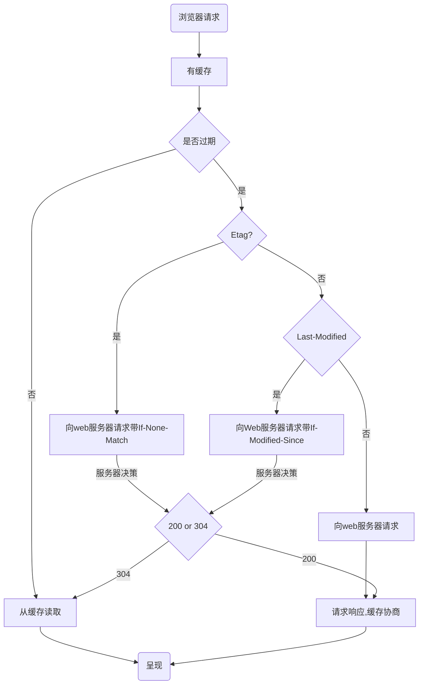

### 1. cookie与session的区别

- [参考](https://mp.weixin.qq.com/s?__biz=MzA4MjA0MTc4NQ==&mid=504090000&idx=3&sn=f57d4f194c902daadd80296d5b8ed001#rd)

- <b>cookie机制</b>

Cookie是服务器在本地机器上存储的小段文本,并随每一次发送至同一个服务器。网络服务器用HTTP头向客户端发送cookies,在客户端中,浏览器解析这些cookies并将它们保存为一个本地文件,它会自动将同一服务器的任何请求束缚上这些cookies。


具体来说,cookie机制采用的是在客户端保持状态的方案.它是在客户端的会话状态的存储机制,他需要用户打开客户端的cookie支持。cookie的作用就是为了解决HTTP协议无状态的缺陷所作的努力。


正统的cookie分发是通过扩展HTTP协议来实现的,服务器通过HTTP的响应头中加上一行特殊的指示,提示浏览器按照指示生成相应的cookie。然而存粹的客户端脚本如JavaScript也可以生成cookie。而cookie的使用是由浏览器按照一定的原则在后台自动发送给服务器的。浏览器检查所有存储的cookie,如果某个cookie所声明的作用范围大于将要请求的资源所在的位置,则把该cookie附在请求资源的HTTP请求头部上发送给服务器


cookie的内容主要包括: 名字、值,过时间,路径和域。路径与域一起构成cookie的作用范围。若不设置过期时间,则表示这个cookiedd的生命周期为浏览器会话期间,关闭浏览器窗口,cookie会消失。这种生命周期为浏览器会话器的cookie被称为会话cookie。会话cookie一般不存储在硬盘上而是保存在内存里,当然这种行为并不是规范规定的。若设置了过期时间,浏览器就会把cookie保存到硬盘上,关闭后再次打开浏览器,这些cookie仍然有效直到超过设定的过期时间。存储在硬盘上的cookie可以在不同的浏览器进程间共享,比如两个IE窗口。而对于保存在内存里的cookie,不同的浏览器有不同的处理方式..


<b>session机制</b>

session机制是一种服务器端的机制,服务器使用一种类似于散列表的结构来保存信息	


当程序需要为某个客户端的请求创建一个session时,服务器首先检查这个客户端的请求里是否已包含了一个session标识,如果已包含则说明以前已经为此客户端创建过session,服务器会按照session id把这个session检索出来使用,如果客户端请求不包含session id,则为此客户端创建一个session并且生成一个与此session相关联的session id, session id的值应该是一个既不会重用又不容易找到规律以仿造的字符串,这个session id将在本次响应中返回给客户端保存.


<b>cookie与session的区别</b>

| 比较值     | cookie                                                       | session                                                      |
| ---------- | ------------------------------------------------------------ | ------------------------------------------------------------ |
| 存取方式   | 只能保管ASCII字符串; Unicode字符需转义; 不能直接存取Java对象 | 能够存取任何类型的数据;可看做是JAVA的一个容器类              |
| 隐私策略   | 存储在客户端的阅读器上,对客户端是可见的                      | 存储在服务器上,对客户端是透明的                              |
| 有效期     | 可以给Cookie的过期时间属性设为一个很大很大的数字             | Session保存在服务器内存中,如果过期时间设置久了,会导致内存泄漏 |
| 服务器压力 | 不占服务器资源.如果阅读的用户十分多,推荐使用Cookie           | 每个用户都会产生一个Session,并发访问的用户十分多,会产生大量session,耗费大量内存 |
| 浏览器支持 | 需要浏览器支持,如果用户禁用了浏览器支持,则cookie不生效       | 若客户端浏览器不支持cookie，则需要用到session和URL重写.否则会失去用户的信息跟踪 |
| 跨域支持   | 支持跨域名访问                                               | 不支持跨域名访问                                             |
| 存储位置   | 客户端                                                       | 服务器                                                       |

### 2. cookie、sessionStorage和localStorage的区别

| 比较对象 | cookie                                                    | sessionSorage                             | localStorage                          |
| -------- | --------------------------------------------------------- | ----------------------------------------- | ------------------------------------- |
| 有效期   | 根据设置的过期时间,过期则消失;未过期,浏览器关闭也不会消失 | 存储在浏览器的内存中,退出浏览器环境即消失 | 存储在客户端硬盘中,不主动删除不会消失 |
| 作用域   | 在同源窗口中是共享的                                      | 在不同的浏览器窗口中是不共享的            | 在同源窗口中是共享的                  |
| 数据大小 | 不能超过4K                                                | 5M左右                                    | 5M左右                                |
| http请求 | 每次都会携带在http头部                                    | 仅在浏览器中保存                          | 仅在浏览器保存                        |
| 应用场景 | 主要用于识别用户登录                                      | 存储一些页面中传递的参数                  | 存储一些页面中传递的参数              |

### 3. http状态码分类

| 分类 | 分类描述                                      |
| ---- | --------------------------------------------- |
| 1**  | 信息,服务器收到请求,需要请求者继续执行操作    |
| 2**  | 成功,操作并成功接收并处理                     |
| 3**  | 重定向,需要进一步的操作以完成请求             |
| 4**  | 客户端错误,请求包含语法错误或无法完成请求     |
| 5**  | 服务端错误,服务器在处理请求的过程中发生了错误 |

### 4. http状态码列表

| 状态码 | 描述                            | 中文描述                                                     |
| ------ | ------------------------------- | ------------------------------------------------------------ |
| 100    | Continue                        | 继续,客户端应继续其请求                                      |
| 101    | Switchin Protocols              | 切换协议,服务器根据客户端的请求切换协议.                     |
| 200    | OK                              | 请求成功,一般用于GET与POST                                   |
| 201    | Created                         | 已创建,成功请求并创立了新的资源                              |
| 202    | Accepted                        | 已接受,已经接收请求,但未完成处理                             |
| 203    | Non-Authoritative Information   | 非授权信息,请求成功,但返回的mate信息不在原始服务器上         |
| 204    | Not Content                     | 无内容,服务器成功处理,但未返回内容                           |
| 205    | Reset Content                   | 重置内容,服务器处理成功,用户终端应重置文档视图               |
| 206    | Partial Content                 | 部分内容,服务器成功处理了部分GET请求                         |
| 300    | Mutiple Choise                  | 多种选择,请求的资源可包括多个位置                            |
| 301    | Moved Permanently               | 永久移动,请求的资源被永久的移动到新URL上                     |
| 302    | Found                           | 临时移动,资源临时被移动.客户端应继续使用原有的URL            |
| 303    | See Other                       | 查看其他地址.                                                |
| 304    | Not Modified                    | 未修改,所请求的资源浏览器返回缓存(未过期)的资源              |
| 305    | Use Proxy                       | 使用代理,所请求的资源必需通过代理访问                        |
| 306    | Unused                          | 已经被废弃的HTTP状态码                                       |
| 307    | Temporary Redirect              | 临时重定向,使用GET请求重定向                                 |
| 400    | Bad Request                     | 客户端请求的语法错误,服务器无法理解                          |
| 401    | Unauthorized                    | 请求要求用户的身份认证                                       |
| 402    | Payment Required                | 保留,将来使用                                                |
| 403    | Forbidden                       | 服务器理理解客户端的请求,但是拒绝执行此请求                  |
| 404    | Not Found                       | 服务器无法找到客户端请求的资源                               |
| 405    | Method Not Allowed              | 客户端请求的方法被禁止                                       |
| 406    | Not Acceptable                  | 服务器无法根据客户端请求的内容特性完成请求                   |
| 407    | Proxy Authentication Required   | 请求要求代理的身份认证,请求者应当使用代理进行授权            |
| 408    | Request Time-out                | 服务器等待客户端发送的请求时间过长,超时                      |
| 409    | Conflict                        | 服务器处理请求时发生了冲突                                   |
| 410    | Gone                            | 客户端请求的资源已经不存在(永久的删除,并不是更改了URL)       |
| 411    | Length Requried                 | 服务器无法处理客户端发送不带`Content-Length`的信息           |
| 412    | Precondition Failed             | 客户端请求信息的先决条件错误                                 |
| 413    | Request Entity Too Large        | 请求的实体过大,服务器无法处理                                |
| 414    | Request-URL Too Large           | 请求的URL过长,服务器无法处理                                 |
| 415    | Unsupported Media Type          | 服务器无法处理请求附带的媒体格式                             |
| 416    | Requested range not satisfiable | 客户端请求的范围无效                                         |
| 417    | Expectation Failed              | 无服务无法满足Expect的请求头信息                             |
| 500    | Interval Server Error           | 服务器内部错误,无法完成请求                                  |
| 501    | Not Implemented                 | 服务器不支持请求的功能,无法完成请求                          |
| 502    | Bad Gateway                     | 作为网关或代理工作的服务器尝试执行请求时,从远程服务器收到一个无效的响应 |
| 503    | Service Unvailable              | 超荷或系统维护导致服务器暂时无法处理客户端的请求             |
| 504    | Gateway Time-out                | 网关(或代理服务器)未能从远端服务器获取请求                   |
| 505    | HTTP Version not supported      | 服务器不支持请求的HTTP协议的版本                             |

### 5. http常用的请求头

| 协议头              | 说明                                                       |
| ------------------- | ---------------------------------------------------------- |
| Accept              | 可接受的内容类型(Content-Types)                            |
| Accept-Charset      | 可接受的字符集                                             |
| Accept-Encoding     | 可接受的响应内容的编码方式                                 |
| Accept-Language     | 可接受的响应内容语言列表                                   |
| Accept-Datetime     | 可接受按照时间来表示的响应内容版本                         |
| Authorization       | HTTP协议中需要认证资源的认证信息                           |
| Cache-Control       | 指定当前的请求/回复中,是否使用缓存机制                     |
| Connection          | 客户端优先使用的连接类型                                   |
| Cookie              | 服务器通过Set-Cookie设置的一个HTTP协议Cookie               |
| Content-Length      | 请求体的长度(8进制表示)                                    |
| Content-MD5         | 数字签名,以Base64编码的结果表示                            |
| Content-Type        | 请求体的MIME类型(用于POST和PUT请求中)                      |
| Date                | 发送该消息的日期和时间                                     |
| Expect              | 客户端要求服务器做出特定的行为                             |
| From                | 发起此请求的用户的邮箱地址                                 |
| Host                | 服务器的域名及端口号                                       |
| If-Match            | 客户端的实体与服务器上对应的实体相匹配时,才进行相应的操作  |
| If-Modified-Since   | 对应的资源未修改,返回304                                   |
| If-None-Match       | 对应的内容未被修改的情况下返回304 Not Modified             |
| If-Range            | 如果实体未被修改,则返回所缺少的哪一个或多个部分            |
| If-Unmodified-Since | 仅当该实体自某个特定时间以来未被修改的情况下,才发送回应    |
| Max-Forwards        | 限制该消息可被代理及网关转发的次数                         |
| Origin              | 发起一个针对跨域资源共享的请求                             |
| Pragma              | 与具体的实现相关,这些字段可能在请求/回应链中的任何时候产生 |
| Proxy-Authorization | 用于向代理进行认证的认证信息                               |
| Range               | 表示请求某个实体的一部分,字节偏移以0开始                   |
| Refer               | 表示浏览器所访问的前一个页面                               |
| TE                  | 浏览器预期接受的传输时的编码方式                           |
| User-Agent          | 浏览器的身份标识字符串                                     |
| Upgrade             | 要求服务器升级到一个高级版本协议                           |
| Via                 | 告诉服务器请求是由哪些代理发出的                           |
| Warning             | 一个一般性的警告,表示在实体内容中可能存在错误              |

### 6. 强缓存与协商缓存

 [参考 - 浏览器缓存机制](https://github.com/amandakelake/blog/issues/41)


<b>概述</b>

良好的缓存策略可以降低资源的重复加载提高网页的整体加载速度

通常浏览器的缓存策略分为两种: 强缓存和协商缓存

- 基本原理
  - 浏览器在加载资源时,根据请求头部的`expires`和`cache-control`判断是否命中强缓存，若是强缓存,则直接从缓存读取资源,不会发送请求到服务器
  - 如果没有名中强缓存,浏览器会发送一条请求给服务器,服务器会根据`last-modified`和`etag`验证资源是否命中协商缓存.如果命中,服务器会返回 304(Not Modified)给浏览器,浏览器会使用缓存中的资源进行显示,并且修改`expires`和`cache-control`
  - 否则,服务器会返回新的数据资源.


<b>注意点</b>

- 强缓存字段有`expires`和`cache-control`,如果同时存在,`cache-control`的优先级会高于expires
- 协商缓存的相关字段:`Last-Modified/If-Modified-Since`,`Etag/If-None-Match`




### 7. 常见的http状态码

| 状态码 | 描述                  | 中文描述                                            |
| ------ | --------------------- | --------------------------------------------------- |
| 200    | Ok                    | 请求成功                                            |
| 201    | Created               | 已经创建,成功请求并创建了新的资源                   |
| 202    | Accepted              | 已经接受请求,但是未处理                             |
| 206    | Partial Content       | 部分内容,服务器已经处理了部分GET请求                |
| 301    | Moved Permanently     | 永久重定向,域名跳转                                 |
| 302    | Found                 | 临时重定向,让未登录的用户访问用户中心               |
| 304    | Not Modified          | 资源未修改,告诉浏览器可以使用本地缓存               |
| 307    | Temporary Redirect    | 临时重定向                                          |
| 400    | Bad Request           | 服务器不能理解服务端的请求                          |
| 401    | Unauthorized          | 需要客户端提供验证信息                              |
| 403    | Forbiden              | 一般是客户端提交的数据无法通过服务端的验证,拒绝访问 |
| 404    | Not Found             | 服务器通过URL无法找到对应的资源                     |
| 500    | Interval Server Error | 服务器收到了请求,但是服务器执行的时候发送了错误     |


### 8. 前端优化

- 降低请求量: 合并资源,减少HTTP请求数, minify / gzip压缩, webP, lazyLoad
- 加快请求速度: 预解析DNS,减少域名数,并行加载,CDN分发
- 缓存: HTTP协议缓存请求,离线缓存manifest,离线数据缓存localStorage
- 渲染: JS/CSS优化,加载顺序,服务端渲染,pipline

### 9. GET和POST的区别

| 属性           | GET                      | POST                     |
| -------------- | ------------------------ | ------------------------ |
| 安全性         | 不安全                   | 比较安全(也不是那么安全) |
| 参数长度       | 被浏览器限制了长度       | 长度一般无限制           |
| 参数是否被缓存 | 可以在浏览历史记录里看到 | 不会被保留               |
| TCP数据包      | 产生1个TCP数据包         | 产生2个TCP数据包         |
| 编码格式       | 只能进行url编码          | 支持多种编码方式         |

### 10. 画一个三角形

利用边框的均分原理

```css
div {
    width: 0px;
    height: 0px;
    border-top: 10px solid red;
    border-right: 10px solid transparent;
    border-bottom: 10px solid transparent;
    border-left: 10px solid transparent;
}
```

### 11. 状态码304和200

- `状态码200`: 请求已成功,请求所希望的响应头或数据体将随此响应返回.即返回的数据未全量的数据,如果文件不通过GZIP压缩的话,文件是多大,则要有多大传输量

- `状态码304`: 如果客户端发送了一个带条件的GET请求且该请求已被允许,而文档的内容(自上次访问以来或者根据请求的条件)并没有改变,则服务器应当返回这个状态码。即客户端和服务器端只需要传输很少的数据量来做文件的校验,如果文件没有修改过,则不需要返回全量的数据

### 12. 说一下浏览器的缓存

- 分为强缓存和协商缓存
  - 浏览器根据IP地址获取资源时,首先在缓存种查找是否含义该资源,如果有且未过期则从缓存种获取,不请求浏览器而直接返回资源,这种返回的资源称为强缓存资源

  - 如果过期了：
    - 如果带有`Etag`,则会向服务器请求(带`If-None-match`)，服务器根据客户端传入的信息,判断客户端中的缓存是否过期,若过期则返回新资源(200),否则返回状态码304,不带有资源
    - 如果不带`Etag`,则会检查是否带`Last-Modified`,如果有,则向服务器请求(带`If-Modified-Since`),服务器根据客户端传入的信息,判断客户端中的缓存是否过期,若过期则返回新资源(200),否则返回状态码304,不带有资源
    - 如果不带`Last-Modified`则直接向服务器直接申请新资源

- 强缓存,是根据是否过期判断的,协商缓存是通过服务器判断的.


### 13. HTML5新增的元素

- `语义化`:新增了 header,footer,nav,aside,section等语义化标签
- `表单`: 新增加了color,email,data,range等类型
- `存储`: 提供了sessionStorage, localStorage 和离线缓存
- `多媒体`: 音频(audio) 和 视频(vedio)
- `其他`: 地理定位,canvas画布、拖放(drag)、多线程(Web Worker)

### 14. 在地址栏输入一个URL到这个页面呈现出来,中间会发生什么

- 输入url后,首先会根据域名去寻找对应的ip
  - 浏览器首先会去寻找缓存,查看缓存中是否有记录,缓存的查找记录为: 浏览器缓存 --> 系统缓存 --> 路由缓存,
  - 缓存中没有则查找hosts文件中是否有记录
  - hosts文件中没有记录则查询DNS服务器,得到ip地址

- 得到ip地址后,浏览器会根据这个ip以及相应的端口号,构造一个http请求
  - 请求报文包括
    - 请求方法
    - 请求说明
    - 请求附带的数据
- 然后,浏览器将http请求封装在一个tcp包中
  - 这个tcp包会一次经过: 传输层、网络层、数据链路层、物理层
- tcp请求到达服务器,服务器请求并返回资源
- 浏览器得到html文档后,第一次会根据html生成一个DOM树,其中遇到异步(如CSS和JS的加载),会将异步任务放到异步队列中去(开一个线程去获取)
- 当同步任务执行完毕后,会去任务队列中去寻找已经完成资源,然后进行事件循环(每次读取队首完成的任务到栈内存中执行,执行完毕在去任务队列中获取).
- 事件循环过后,所有CSS加载完成,会生成一棵CSSOM规则.然后浏览器会将DOM树和CSSOM规则合并成一棵渲染树,主要是排除非视觉节点(`Script、meta..`)
- 紧接着进行`回流(Layout)`: 根据渲染树,计算出它们在视口(viewPort)中的准确位置和大小.
- 然后`重绘(Painting)`: 根据Render树和回流得到的几何信息,得到绝对像素点
- Display: 将像素点发送给GPU进行渲染


### 15. 常见的http的头部

- 首部可以分为:
  - 通用首部
    - 一些通用的信息: 如date表示报文创建时间
  - 请求首部
    - 请求报文中独有的: cookie, 和缓存相关的如 `if-Modified-Since`
  - 响应首部
    - 响应报文中独有的: 如`set-cookie`,和重定向相关的`location`
  - 实体首部
    - 用来描述实体部分, `allow`用来描述可执行的请求方法,`content-type`描述主体类型,`content-Encoding`描述主体的编码方式

### 16. http2.0特性

1. 内容安全: 基于https,天然具有安全性,通过http2.0的特性可以避免单纯使用https的性能下降
2. 二进制格式: http1.x的解析是基于文本的, http2.0将所有的传输信息分割为更小的消息和帧,并对他们采用二进制格式编码,基于二进制可以让协议有更多的扩展性,比如引入了帧来传输数据和指令
3. 多路复用,这个功能相当于是长连接的增强,每个request请求可以随机的混杂在一起,接收方可以根据request的id将request再归属到各自不同的服务端请求里面,另外多路复用中也支持了流的优先级,允许客户端告诉服务器哪些内容是更优先的资源,可以优先输出.