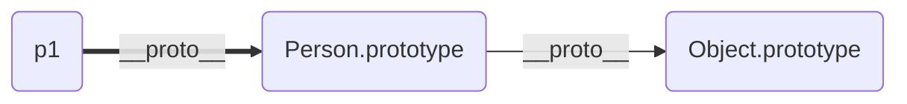
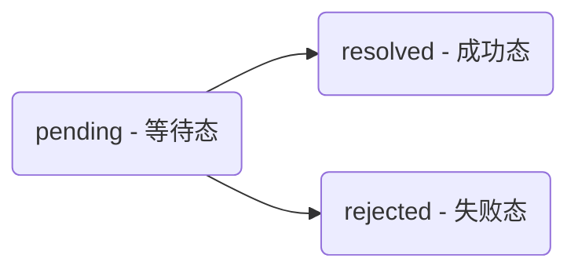

# 面试官问: 你了解HTTP2.0吗?

[参考](https://juejin.im/post/5c0ce870f265da61171c8c66)

<b>HTTP发展史</b>

- HTTP/0.9 - 单行协议
  - 问世于1990年,那时的HTTP非常简单: 只支持GET方法; 没有首部; 只能获取纯文本
- HTTP/1.0 - 搭建协议的框架
  - 1996年,HTTP正式被作为标准公布,版本为HTTP/1.0。1.0版本增加了首部、状态码、权限、缓存、长连接(默认短连接)等规范,可以说搭建了协议的基本框架。
- HTTP/1.1 - 进一步完善
  - 1997年,1.1版本接踵而至。1.1版本的重大改进在于默认长连接; 强制客户提供Host首部;管线化;Cache-Control、ETag等缓存的相关扩展
    - 注: Etag和Last-Modified同时存在,以Etag为主


【HTTP/1.0的缺陷】:

1. 连接无法复用: 一个连接对应一次握手
2. 队头阻塞: 前面一个连接未完成,后面的连接无法进行


对于问题1, HTTP/1.1新增了一个`connection: keep-alive`,使连接完成后不断开.


<b>目前存在的问题</b>

​	我们先来看看HTTP发展到1.1存在的问题:

1. 线头阻塞: TCP连接上只能发送一个请求,前面的请求未完成前,后续的请求都在排队等待.
2. 多个TCP连接:
   - 虽然HTTP/1.1管线化可以支持请求并发,但是浏览器很难实现,chrome、firefox等都禁用了管线化.所以1.1版本请求并发依赖于多个TCP连接,建立TCP连接成本很高,还回存在慢启动的问题.
3. 头部冗余,采用文本格式
   - HTTP/1.X版本是采用文本格式,首部未压缩,而且每一个请求都会带上cookie、user-agent等完全相同的首部
4. 客户端需要主动请求


<b>HTTP/2.0中的一些重大改进</b>

HTTP2性能提升的核心就在于二进制分帧层。HTTP2是二进制协议,他采用二进制格式传输数据而不是HTTP/1.x的文本格式

- 1.1响应是文本格式,而2.0把响应划分为两个帧
  - HEADERS frame: 首部
  - DATA frame: 消息负载

- 也就是说: 一条HTTP响应,划分为两个帧来传输,并且采用二进制来编码
  - 流(Stream): 已经建立TCP连接上的双向字节流,可以承载一个或多个消息
  - 消息(Message): 一个完整的HTTP请求或响应,由一个或多个帧组成。特定消息的帧在同一个流上发送,这意味着一个HTTP请求或响应只能在一个流上发送.
  - 帧(Frame): 通信的基本单位。 一个TCP连接上可以由任意数量的流


<b>多路复用</b>

HTTP/2.0让所有的通信都在一个TCP连接上完成,真正实现了请求的并发.

HTTP/2.0建立一个TCP连接,一个连接上面可以有任意多个流(stream),消息分割成一个或多个帧在流里面传输。帧传输过去以后,再进行重组,形成一个完整的请求或响应。这使得所有的请求或响应都无法阻塞。


<b>头部压缩</b>

在1.X版本中,首部用文本格式传输,通常会给每个传输增加500~800字节的开销。大多数请求的首部字段是相同的(如cookie、user-agent等)。

HTTP2为此采用HPACK压缩格式来压缩首部,头部压缩需要在浏览器和服务器之间:

- 维护一份相同的静态字典,包含常见的头部名称,以及常见的头部名称和值的组合
- 维护一份相同的动态字典,可以动态的添加内容
- 通过静态Huffman编码对传输的首部字段进行编码


HTTP/2.0的静态字典,部分:

| Index | Header Name | Header Value |
| ----- | ----------- | ------------ |
| 1     | :authority  |              |
| 2     | :method     | GET          |
| 3     | :method     | POST         |
| 4     | :path       | /            |
| 5     | :path       | /index.html  |
| 6     | :schema     | http         |
| 7     | :schema     | https        |
| 8     | :status     | 200          |
| 9     | :status     | 204          |

所以我们在传输首部字段的时候,例如要传输`method:GET`,那我们只需要传输静态字典里面`method: GET`对应的索引值就可以了,一个字节搞定.

像`user-agent、cookie`这种字典里面只有首部名称而没有值的首部,第一次传输需要`user-agent`在静态字典中的索引以及他的值,值会采用Huffman编码来减小体积

第一次传输过`user-agent`之后,浏览器和服务器就会把它添加到自己的动态字典中。后续传输就可以传输索引了,一个字节

<b>服务器推送技术</b>

- 服务器推送: 使得服务器可以预测客户端需要的资源,主动推送到客户端

- 例如: 客户端请求index.html,服务器端能够额外推送`script.js`和`style.css`.原理:
  - 客户端发送请求时,服务器能够分析这个页面所依赖的其他资源,主动推送到客户端的缓存
  - 当客户端收到原始网页的请求时,它需要的资源已经位于缓存


# 你真的了解回流和重绘吗?

[参考](https://segmentfault.com/a/1190000017329980) - 强烈推荐看看,这个作者写了很多特别好的文章.


<b>浏览器渲染过程</b>

1. 解析HTML,生成DOM树; 解析CSS生成CSSOM树
2. 将DOM树和CSSOM树合并,生成渲染(Render)树
3. Layout(回流): 根据生成的渲染树,视口(viewport),得到节点的几何信息(位置、大小)
4. Painting(重绘): 根据渲染树和几何信息得到节点的绝对像素
5. Display: 将像素发送给GPU,展示在页面上


<b>生成渲染树</b>


为了构建渲染树,浏览器主要完成了以下工作:

1. 从DOM树的根节点开始遍历每个可见节点
2. 对于每个可见的节点,找到CSSOM树中的规则,并应用它们
3. 根据每个可见节点及其对应的样式,组合生成渲染树


【不可见的节点】:

- 一些不会渲染输出的节点: 比如script、meta、link等
- 一些通过css进行隐藏的节点。比如display: none。注意,利用visibility和opacity隐藏的节点,还是会显示在渲染树上的。只有display:none的节点才不会显示在渲染树上


【注意】: 渲染树只包括可见的节点


<b>回流(Layout)</b>

前面将DOM节点以及它对应的样式结合起来,可是我们还需要计算它们在设备视口(viewport)内的确切位置和大小,这个计算的阶段就是回流。看下面的栗子:

```html
<!DOCTYPE html>
<html>
    <head>
        <meta name="viewport" content="width=device-width,initial-scale=1">
        <title>Cretical Path: Hello Marron!</title>
    </head>
    <body>
        <div style="width: 50%">
            <div style="width: 50%">Hi Marron, best wish!</div>
        </div>
    </body>
</html>
```

我们可以看到,第一个div将节点的显示尺寸设置为视口宽度的50%,第二个div将其尺寸设置为父节点的50%.而在回流这个阶段,我们就需要根据视口具体的宽度,将其转为实际的像素值。

​	


<b>重绘 (Painting)</b>

- 生成渲染树阶段: 我们直到了哪些节点是可见的以及可见节点的样式
- 在回流阶段: 我们得到了可见元素的具体几何信息

>我们得到的信息,最终都会托付给GPU进行渲染

GPU的渲染需要具体的像素位置,这就是重绘阶段所做的事情： 根据渲染树和几何信息计算出绝对像素点.


<b>何时发生回流重绘</b>

回流主要是计算节点的几何位置和几何像素大小.那么当页面布局和几何信息发生变化的时候,就需要回流:

- 添加或删除可见的DOM元素
- 元素的位置发生变化
- 元素的尺寸发生变化(内/外边距、边框大小、高度和宽度等)
- 内容发生: 文本发生变化或图片被另一个不同尺寸的图片所替代
- 页面刚开始渲染的时候
- 浏览器的窗口尺寸变化: 回流是根据视口的大小来计算元素的位置和大小的


> 经典老话: 回流一定重绘,重绘不一定回流


<b>浏览器的优化机制</b>

现代的浏览器都是很聪明的,由于每次重排都会造成造成额外的计算消耗,因此大多数浏览器都会通过队列修改、批量执行来优化重排过程。浏览器会将修改操作放在队列里,直到过了一段时间,或者操作达到一个阈值,才清空队列。

还有一些强制刷新的属性(避免使用):

- offsetTop、offsetLeft、offsetWidth、offsetHeight
- scrollTop、scrollLeft、scrollWidth、scrollHeight
- clientTop、clientLeft、clientWidth、clientHeight
- getComputedStyle()
- getBoundingClientRect
- ...


<b>前端优化</b>

1 -【并多次的DOM和添加样式】

```js
// 未优化前 - 3次
const el = document.getElementById('test')
el.style.padding = '5px';
el.style.borderLeft = '1px';
el.style.borderRight = '2px';

// 合并样式 - 1次
const el = document.getElementById('test');
el.style.cssText += 'border-left: 1px; border-right: 2px; padding: 5px'

// 添加样式 - 1次
const el = document.getElementById('test');
el.calssName += ' active';
```

2 -【脱离文档流】

当元素脱离文档流后,对元素的所有操作都不会引起回流和重绘.因此如果,对某个元素进行的DOM操作比较多的时候,可以先将元素脱离文档流,然后操作,最后在放回文档流。具体操作如下:

1. 使元素脱离文档流
2. 对其进行多次修改
3. 将元素带回到文档中.

[注] : 上述的1、3会引起回流和重绘.


【脱离文档流的方法】

- 隐藏元素,修改应用,重新显示
- 使用文档片段(document fragment)在使用DOM之外构建一个子树,再把它拷贝回文档
- 将原始元素拷贝到一个脱离文档的节点中,修改节点后,再替换原始的元素。


```js
// 每次插入li都会引起一次回流和重绘
function appendDataToElement(appendToElement, data) {
    let li;
    for(let i =0,len = data.length;i < len;i++){
        li = document.createElement('li');
        li.textContent = 'text';
        appendToElement.appendChild(li);
    }
}

const ul = document.getElementById('list');
appdenDataToElement(ul, data);
```

[隐藏元素]

```js
// 仅在隐藏元素和现实元素时产生2次回流和重绘
function appendDataToElement(appendToElement, data) {
    let li;
    for(let i =0, len = data.length; i < len; i++){
        li = document.createElement('li');
        li.textContent = 'text';
        appendTOElement.appendChild(li);
    }
}

const ul = document.getElementById('list');
ul.style.display = 'none';
appendDataToElement(ul, data);
ul.style.display = 'block';
```

[使用文档片段] - 在当前DOM外构建一个子树,再把它拷贝回文档

```js
const ul = document.getElementById('list');
const fragment = document.createDocumentFragment();
appendDataToElement(fragment, data);
up.appendChild(fragment);
```

[脱离文档] - 将原始元素拷贝到一个脱离文档的节点中,修改节点,再替换原始的元素。

```js
const ul = document.getElementById('list');
const clone = ul.cloneNode(true);
appendDataToElement(clone, data);
ul.parentNode.replaceChild(clone, ul);
```

[注] - 现代浏览器使用了队列来存储多次修改,因此上述的优化可能效果不是很理想.

3 - 【避免触发同步布局事件】

```js
// 栗子: 多次使用到 offsetWidth 属性
function initP(){
    for(let i = 0; i< paragraph.length; i++){
        paragraph[i].style.width = box.offsetWidth + 'px'
    }
}
```

上述代码每次循环,都会使浏览器强制刷新队列(`box.offsetWidth`),造成多次回流和重绘.改进如下:

```js
const width = box.offsetWidth;
function initP(){
    for(let i = 0; i < paragraph.length; i++){
        paragraph[i].style.width = width + 'px'
    }
}
```

4 - 【复杂动画的优化】

对于复杂动画效果,由于会经常的引起回流和重绘。因此,我们可以使用绝对定位,让它脱离文档流。否则会引起父元素以及后续元素频繁的回流 - [栗子]([https://chenjigeng.github.io/example/share/%E9%81%BF%E5%85%8D%E5%9B%9E%E6%B5%81%E9%87%8D%E7%BB%98/%E5%B0%86%E5%A4%8D%E6%9D%82%E5%8A%A8%E7%94%BB%E6%B5%AE%E5%8A%A8%E5%8C%96.html](https://chenjigeng.github.io/example/share/避免回流重绘/将复杂动画浮动化.html))


# 对MVVM的了解

MVVM是Model-View-ViewModel的缩写

<b>Model</b>代表数据模型,也可以在Model中定义数据修改和操作的业务逻辑

<b>View</b>代表UI组件,它负责将数据模型转化成UI展现出来

<b>ViewModel</b>监听模型数据的改变和控制视图的行为、处理用户交互,简单理解就是一个同步View和Model的对象,连接Model和View.

在MVVM架构下,View和Model之间并没有直接的联系,而是通过ViewModel进行交互,Model和ViewModel之间的交互是双向的,因此View数据的变化会同步到Model中,而Model数据的变化也会立即反应到View上

<b>ViewModel</b>通过双向数据绑定把View层和Model层连接了起来,而View和Model之间的同步工作完全是自动的,无需认为干涉,因此开发者只需关业务逻辑,不需要手动操作DOM,不需要关注数据状态的同步问题,复杂的数据状态维护完全由MVVM来统一管理

# Vue的生命周期

<b>beforeCreate</b>(创建前)在数据观测和初始化事件还未开始

<b>created</b>(创建后)完成数据观测,属性和方法的运算,初始化事件,$el属性还没有显示出来

<b>beforeMount</b>(载入前)在挂在开始之前被调用,相关的render函数首次被调用。实例已经完成以下的配置: 编译模板,把data里面的数据和模板生成生成html.注意,此时还没有挂在到html页面上

<b>mounted</b>(载入后)在el被新创建的vm.$el替换,并挂载到实例上去之后调用.实例已完成以下配置: 用上面编译好的html内容替换el属性指向的DOM对象。完成模板中的html渲染到html页面中。此过程进行ajax交互。

<b>beforeUpdate</b>(更新前)在数据更新之前调用,发生在虚拟DOM重新渲染和打补丁之前.可以在该钩子中进一步地更改状态,不会触发附加的重新渲染过程。

<b>updated</b>(更新后)在由于数据更改导致的虚拟DOM重新渲染和打补丁后调用。调用时,组件DOM已经更新,所以可能会导致更新无限循环.该钩子在服务器渲染期间不被调用.

<b>beforeDestroy</b>(销毁前)在实例销毁之前调用.实例仍然完全可用.

<b>destroyed</b>(销毁后)在实例销毁之后调用。调用后所有的事件监听器会被移除,所有的子实例也会被销毁。该钩子在服务器渲染期间不被调用


1. 什么是vue生命周期?

答: Vue实例从创建到销毁的过程,就是生命周期.从开始创建、初始化数据、编译模板、挂载DOM渲染、更新->渲染、销毁等一些列过程,称之为Vue的生命周期


2. 生命周期的作用是什么?

答: 它的生命周期中有多少个事件钩子,让我们在控制整个Vue实例的过程时更容易形成好的逻辑


3. vue生命周期总共有几个阶段?

答: 它可以总共分为8个阶段: 创建前/后,载入前/后,更新前/后,销毁前/后


4. 第一次页面加载会触发哪几个钩子?

答: 会触发下面几个beforeCreated,created,beforeMount,mounted


5. DOM渲染在哪个周期中就已经完成了?

答: DOM渲染在mounted中就已经完成了


# Vue实现数据双向绑定原理

vue实现数据双向绑定主要是: <b>采用数据劫持结合发布-订阅者模式的方式</b>,通过`Object.defineProperty()`来劫持各个属性的`setter、getter`,在数据变动时发布消息给订阅者,触发相应监听回调.当把一个普通JavaScript对象传给Vue实例来作为它的data选项时,Vue将遍历它的属性,用Objetc.defineProperty将它们转为getter/setter.用户看不到getter/setter,但是在内部,它们让Vue追踪依赖,在属性被访问和修改的时通知变化.


vue的数据双向绑定将MVVM作为数据绑定的入口,整合Observer,Compiler和Watcher三者,通过Observer来监听自己的model的数据变化,通过Compiler来解析编译模板指令(vue中是用来解析{{}}),最终利用watcher搭起observer和Compile之间的通信桥梁,达到数据变化 -> 视图更新;视图交互变化(input) -> 数据model变更双向绑定效果


<b>js实现简单的双向绑定</b>

```html
<body>
    <div id="app">
        <input type="text" id="txt">
    </div>
</body>
<script>
    var obj = {}
    var newObj = {}
    newObj = obj
    Object.difineProperty(obj, 'txt', {
        get: function(){
            return newObj
        },
        set: function()
    })
</script>
```

# 对象原型

[参考 - MDN](https://developer.mozilla.org/zh-CN/docs/Learn/JavaScript/Objects/Object_prototypes)

## Javascript中的原型

在Javascript中,每一个函数都有一个特殊的属性,叫做原型

下面获取函数的原型`fn.prototype`

```js
function f1(){}
console.log(f1.prototype)
/*
	{
		constructor: f f1()
		__proto__:{
			constructor: f Object()
			__defineGetter__: f __defineGetter__()
			__defineSetter__: f __defineSetter__()
			hasOwnProperty: f hasOwnProperty()
			__lookupGetter__: f __lookupGetter__()
			__lookupSetter__: f __lookupSetter__()
			isPrototypeOf: f isPrototypeOf()
			...
		}
	}
*/
```

下面给函数的原型添加属性`fn.prototype.hello = 'world'`

```js
function f1(){}
f1.prototype.hello = 'world'
console.log(f1.prototype)
/*
	{
		hello: "world"
		constructor: f f1()
		__proto__: Object
	}
*/
```

创建一个函数的实例`new fn()`,并给实例添加属性

```js
function Person(){}
Person.prototype.hello = 'world'
var p1 = new Person()
p1.say = 'hi'
console.log(p1)
/*
	{
		say: "Hi"
		__proto__:{
			hello: "world"
			constructor: f Person()
			__proto__: Object
		}
	}
*/
```

浏览器访问某个属性的寻找顺序:

- 首先会寻找这个实例是否含有该属性
- 如果有则返回,否则会通过`__proto__`寻找该实例的原型`Person.prototype`上是否含有该属性.
- 如果有则返回,否则会通过`__proto__.__proto__`的上寻找该属性.
- 如此循环.到最后`__proto__.__proto__. ... = undefined`则返回undefined

## 理解原型对象

下面定义一个构造器函数

```js
function Person(first, last, age, gender, interests){
    this.first = first
    this.last = last
    this.age = age
    this.gender = gender
    this.interests = interests
}
var p1 = new Person("Li","Bruce",18,'男','coding')
console.log(p1.__proto__ === Person.prototype) // true
console.log(p1.__proto__.__proto__ === Object.prototype) // true
console.log(p1)
/*
	{
		first: "Li"
		last: "Bruce"
		age: 18
		gender: "男"
		interests: "coding"
		__proto__:{
			constructor: f Person(first, last, age, gender, interests)
			__proto__:{
				constructor: f Object()
				__defineGetter__: f __defineGetter__()
				...
				valueOf: f valueOf()
				...
			}
		}
	}
*/
```

- 此时存在一条原型链:



此时,调用如下:

```js
p1.valueOf()
```

根据前面的规则:

- 浏览器首先检查,p1对象是否含有`valueOf()`方法
- 如果没有,则浏览器检查p1对象的原型对象(Person.prototype, 通过浏览器提供的`__proto__`访问)是否具有可用的`valueOf()`方法
- 如果还没有,浏览器会检查`Person()`构造函数的prototype属性所指向的对象的原型对象(Object.prototype)是否含有该方法,如果有则返回,否则返回undefined

> 原型链中的方法和属性没有被复制到其他对象 -- 它们被访问需要通过"原型链"的方式
>
> 官方并未提供`__proto__`属性,在JavaScript语言标准中用[[prototype]]表示.然而,大多数现代浏览器还是提供了一个名为`__proto__`的属性.


## prototype属性: 继承成员被定义的地方

查看[MDN - Object](https://developer.mozilla.org/zh-CN/docs/Web/JavaScript/Reference/Global_Objects/Object)可以看到,Object有很多属性,但是在上面的p1中,并不是全部都继承了.

原因在于: 被继承的属性仅仅只是定义在`Object.prototype`上的属性.定义在Object本身上的属性是不会被继承的

看下面的栗子:

```js
function Person(){}
console.log(Person.prototype)
/*
	{
		constructor: f Person()
		__proto__: Object
	}
*/
```

默认情况下,构造器(此处为Person)的`prototype`属性初始为空白.


## 静态成员与实例成员

- `静态成员`: 在构造函数本身上添加的成员
- `实例成员`: 构造函数内部通过this添加的成员,只能通过实例化的对象来访问

```js
function Person(name, age){
    this.name = name
    this.age = age
}
Person.sex = '男'
var p1 = new Person('Marron', 18)
// name、age就是实例成员
// sex就是静态成员
```

## 使用prototype的好处

节约内存.例如下述:

```js
function Person(name, age){
    this.name = name
    this.age = age
    this.sayHi = function(){
        console.log('Hi ~')
    }
}
var p1 = new Person('Mar', 18)
var p2 = new Person('Marron', 19)
```

上面通过构造函数,生成了2个实例化对象,但是两个实例化对象的方法的内存地址是不同的.

```js
console.log(p1.sayHi == p2.sayHi)  // false
```

引用prototype属性可以节约内存

```js
function Person(name, age){
    this.name = name
    this.age = age
}
Person.prototype.sayHi = function(){
    console.log('Hi ~')
}
var p1 = new Person('Mar', 18)
var p2 = new Person('Marron', 19)
console.log(p1.sayHi == p2.sayHi)  // true
p1.sayHi()	// "Hi ~"
```

- 可见构造函数通过`Person.prototype`类似构造的所有对象是共享的(同一个内存空间)
- javascript规定,每一个构造函数都有一个prototype属性,指向另一个对象.

# this指向

[参考 - MDN](https://developer.mozilla.org/zh-CN/docs/Web/JavaScript/Reference/Operators/this)

与其他语言相比,<b>函数的this关键字</b>在JavaScript中的表现略有不同,此外,在[严格模式](https://developer.mozilla.org/zh-CN/docs/Web/JavaScript/Reference/Strict_mode)和非严格模式之间也会有一些差别.


在绝大多数情况下,函数的调用方式决定了`this`的值.`this`不能在执行期间被赋值,并且在每次函数被调用时`this`的值也可能会不同。ES5引入了[bind](https://developer.mozilla.org/zh-CN/docs/Web/JavaScript/Reference/Global_Objects/Function/bind)方法来设置函数的`this`值,而不用考虑函数如何被调用的,ES2015引入了支持`this`词法解析的箭头函数(它在闭合的执行环境内设置`this`的值)


## 全局环境

无论是否在严格模式下,在全局执行环境中, `this`都会指向全局对象

```js
console.log(this === window)

a = 37
console.log(window.a)

this.b = 'MDN'
console.log(window.b)
cosnole.log(b)
```

## 函数(运行内)环境

在函数内部,`this`的值取决于函数被调用的方式

```js
function f1(){
    return this
}
f1() === window		// 浏览器中,全局对象是window

f1() === global		// Node环境中,全局对象是global
```

在严格模式下,`this`将保持他进入执行环境时的值,所以下面的this将会默认为`undefined`

```js
function f2(){
    "use strict"
    return this;
}
f2() === undefined; 	//true
```

> 在严格模式下,如果this没有被执行环境定义,那它将保持undefined

如果想要把`this`的值从一个环境传到另一个,就要用`call`或者`apply`方法

```js
// 将一个对象作为call和apply的第一个参数,this会被绑定到这个对象
var obj = { a: 'Custom' };

var a = 'Global'

function whatsThis(arg){
    return this.a
}

whatsThis();	// "Global"
whatsThis.call(obj);  // "Custom"
whatsThis.apply(obj);	// "Custom"
```

当一个函数在其主体中使用`this`关键字时,可以通过函数继承自`Function.prototype`的`call`和`apply`方法将`this`值绑定到调用中的特定对象

```js
function add(c, d) {
    return this.a + this.b  + c + d
}
var o = {a: 1, b: 3}
add.call(o, 5 ,7)

app.apply(o, [10, 20])
```

## bind方法

ECAMScript5引入了Function.prototype.bind.调用`f.bind(someObject)`会创建一个与f具有相同函数体和作用域的函数,但是在这个新函数中,this将永久地被绑定到了`bind`的第一个参数,无论这个函数是如何被调用的

```js
function f(){
    return this.a
}
var g = f.bind({a: 'azerty'})
console.log(g())	// "azerty"

var h = g.bind({a: 'yoo'})	// bind只生效一次
console.log(h())	// azerty

var o = {a:37, f:f, g:g, h:h}
console.log(o.f(), o.g(), o.h())	// 37, azerty, azerty
```


## 箭头函数中的this

在箭头函数中,this与封闭词法环境的this保持一致。在全局代码中,它将被设置为全局对象

```js
var globalObject = this;
var foo = (() => this)
console.log(foo() === globalObject)		// true
```

> 注意: 如果将this传递给call、back或者apply,它将被忽略。不过你仍然可以为调用添加参数,不过第一个参数应该设置为null

```js
var globalObject = this;
var foo = (()=> this)
console.log(foo() === globalObject)

var obj = { foo: foo}
console.log(obj.foo() === globalObject)		// true

console.log(foo.call(obj) === globalObject)		// true

foo = foo.bind(obj)
console.log(foo() === globalObject)
```

无论如何,foo的this被设置为他被创建时的环境(在上面的例子中,就是全局对象).这样同样适用于在其他函数内创建的箭头函数: 这些箭头函数的this被设置为封闭的词法环境

```js
var obj = {
    bar: function(){
        var x = (()=> this)
        return x
    }
}

var fn = obj.bar()

console.log(fn() === obj)  // true

var fn2 = obj.bar

console.log(f2()() === window)	
```

# 手写promise

一种异步的解决方案, [参考](https://www.jianshu.com/p/c633a22f9e8c)

## Promise代码基本结构

```js
function Promise(executor){
    this.state = 'pending';
    this.value = undefined;
    this.reason = undefined;
    
    function resolve(){
        
    }
    
    function reject(){
        
    }
}
module.exports = Promise
```

state保存的是当前的状态,在Promise状态发展只有以下两种模式且不可逆:



从上可知,状态只能由`pending变为resolved`(执行resolve)或`pending变为rejected`(执行reject)

这就引出了resolve和reject的功能

```js
function Promise(executor){
    this.state = 'pending'
    this.value = undefined
    this.reason = undefined
    
    function resolve(value){
        this.state = 'resolved'
        this.value = value
    }
    
    function reject(reason){
        this.state = 'rejected'
        this.reason = reason
    }
    
    executor(resove, reject)
}
```

## then方法的实现

当Promise的状态发生了改变,不论是成功或是失败都会调用then方法

```js
let p = new Promise((resolve, reject)=>{
    setTimeout(()=>{
        resolve(1)
    },50)
})
p.then(data=>{console.log(data)})
```

可以得出then的方法,由于then方法是每个实例所以共有,因此可以将其写在原型链上:

- 接受2个参数,成功的回调`onFulfilled`和`onRejected`
  - 两个函数分别在`resolved`状态下和`rejected`状态下执行

```js
Promise.prototype.then = function(onFulfilled, onRejected){
    if(this.state === 'resolved'){
        onFulfilled(this.value)
    }
    if(this.state === 'rejected'){
        onRejected(this.reason)
    }
}
```

当你写出了以上的代码,在同步的情况下执行完全没有问题. 但是在异步的情况下,流程如下:

- 函数执行`new Promise`,当遇到`setTimeout`时,会将其推入一个异步队列中
- 然后执行p.then: 浏览器会顺着原型链找到`Promise.prototype.then`发现此时的状态是`pending`,故不做任何处理,结束同步处理
- 开始执行异步队列里面的`setTimeout`,执行`resovle(1)`.

## 异步方法的实现

处理异步方法的关键是,在`Promise.prototype.then`方法中,当状态为`pending`时,可以将处理函数作为变量存储起来,这样当异步过后,执行`resolve`时,可以在内存中找到相应的处理函数并对其进行执行.

这就需要我们修改Promise构造函数

```js
function Promise(exector){
    this.state = 'pending'
    this.value = undefined
    this.reason = undefined
    this.onResolvedCallbacks = []	// 用于存储成功的回调
    this.onRejectedCallbacks = []	// 用于存储失败的回调
    
    function resolve(value){
        if(this.state === 'pending'){
            this.state = 'resolved'
            this.value = value
            this.onResolvedCallbacks.forEach(resolved=> resolved(value))
        }
    }
    function reject(reason){
        if(this.state === 'pending'){
            this.state = 'rejected'
            this.reason = reason
            this.onRejectedCallbacks.forEach(rejected=> rejected(reason))
        }
    }
}

// 修改 Promise.prototype.then
Promise.prototype.then = function (onFulfilled, onRejected){
    if(this.state === 'resolved'){
        onFulFilled(this.value)
    }
    if(this.state === 'rejected'){
        onRejected(this.reason)
    }
    // 异步: 将回调函数放入内存中.
    if(this.state === 'pending'){ 
        if(typeof onFulfilled === 'function'){
            this.onResolvedCallbacks.push(onFulfilled)
        }
        if(typeof onRejected  === 'function'){
            this.onRejectedCallbacks.push(onRejected)
        }
    }
}
```

> 当涉及到异步,使用this时要绝对小心

在使用setTimeout,里面回调使用的函数中的this是指向window的(通过debugger调试可以获得).这就需要在一开始时,将指向实例的this保存下来.

```js
function Promise(exector){
    let _this = this
    _this.state = 'pending'
    _this.value = undefined
    _this.reason = undefined
    _this.onResovledCallbacks = []
    _this.onRejectedCallbacks = []
    
    function resolve(value){
        _this.state = 'resolved'
        _this.value = value
        _this.onResolvedCallbacks.forEach(resolved => resolved(value))
    }
    function reject(reason){
        _this.state = 'rejected'
        _this.reason = reason
        _this.onRejectedCallbacks.forEach(rejected=> rejected(reason))
    }
    exector(resolve, reject)
}
Promise.prototype.then = function(onFulfilled, onRejected){
    if(this.state === 'resolved'){
        onFulfilled(this.value)
    }
    if(this.state === 'rejected'){
        onRejected(this.reason)
    }
    if(this.state === 'pending'){
        if(typeof onFulfilled === 'function'){
            this.onResolvedCallbacks.push(onFulfilled)
        }
        if(typeof onRejected === 'function'){
            this.onRejectedCallbacks.push(onRejected)
        }
    }
}
```

# 快排

思路: 将每次的第一个元素作为基准,将比基准小的放在left数组中,比基准大的放在right数组中.然后返回[left, pivot,right]

```js
function qSort(arr){
    let pivot,left = [],right = []
    function loop(arr){
        pivot = arr[0]
        left = []
        right = []
        for(let i=0, len = arr.length; i < len; i++){
            if(arr[i] > pivot){
                right.push(arr[i])
            } else{
                left.push(arr[i])
            }
        }
        return loop(left).concat(pivot, loop(right))
    }
    return loop(arr)
}
```

# 冒泡排序

思路:

- 记录待排序的数组长度 len
- 当len大于0时,会进入循环
  - 会使用nextLen保存下次循环的长度.(为undefined会跳出循环)
  - 每次循环都从第0号位开始,最后到len.
  - 比较左右2边的元素
    - 左 > 右: 则交换左右两边的位置,并将nextLen置为当前的下标
  - 每次到循环结束,都会将len设为nextLen

```js
function bubbleSort(arr){
    let len = arr.length;
    while(len > 0){
        let tmp,nextLen
        for(let i =0 ; i< len; i++){
            if(arr[i]>arr[i+1]){
                tmp = arr[i]
                arr[i] = arr[i+1]
                arr[i+1] = tmp
                nextLen = i
            }
            len = nextLen
        }
    }
    return arr
}
```

# 单例模式实现 发布/订阅 模式

- 单例模式即只有一个实例

- 发布订阅模式,即使用`addDep`添加依赖.使用`notify`

```js
class Observer{
	constructor(){
        this.events ={}
    }
    
	addDep(tag, handler){
        if(Array.isArray(this.events[tag])){
            // 是一个数组
            this.events[tag].push(handler)
        }else{
            this.events[tag] = [handler]
        }
    }
    
    notify(tag, params){
        this.events[tag].forEach(fn => fn(params))
    }
}
```

以上实现了一个简单的观察者模式,下面使用单例模式对其进行改造.

简单的说就是在使用`new Observer`时,返回的是同一个实例.给构造函数添加一个获取单例的方法

```js
class Observer{
    constructor(){
        this.events = {}
        this.instance = null
    }
}
Observetr.getInstance = function (){
    if(this.instance == null){
        this.instance = new Observer
    }
    return this.instance
}

let o1 = Observetr.getInstance()
let o2 = Observetr.getInstance()
console.log(o1 === o2)		// true
```


# 回溯法

[参考 - 剑指Offer](https://detail.tmall.com/item.htm?id=548092981894&ali_refid=a3_430583_1006:1103241722:N:HiAgHJHf19eAlJ6gWxZpnfjGlndijUZf:a1d726725481a48865a76287085ac529&ali_trackid=1_a1d726725481a48865a76287085ac529&spm=a230r.1.14.1)

回溯法可以看成蛮力法的升级版,它从解决问题每一步的所有可能选项里系统地选择出一个可行的解决方案.

回溯法解决的问题的特性:

- 可以形象地用树状结构表示:
  - 节点: 算法中的每一个步骤
  - 节点之间的连接线: 每个步骤中的选项,通过每一天连接线,可以到达下一个子步骤
  - 叶子节点: 代表一个步骤的最终状态
- 如果在叶节点的状态满足需求,那么我们找到了一个可行的解决方案

- 如果在叶节点的状态不满足约束条件,那么只好回溯到它的上一个节点再尝试其他的选项。如果上一个节点所有可能的选项都已经试过,并且不能达到满足约束条件的终结状态,则再次回溯到上一个节点.如果所有节点的所有选项都已经尝试过仍然不能达到满足约束条件的终结状态,该问题无解


## 栗子 - 数组总和

[题目参考 - 39.数组总和](https://leetcode-cn.com/problems/combination-sum/)

算法思路:

- 变量:
  - 使用len缓存当前数组的长度
  - 使用path缓存当前的路径
  - 使用res缓存要返回的结果
- 处理:
  - 为了方便后续的剪枝操作,需先对数组进行排序
- 使用深度优先算法,传入3个参数: resides(离目标还差多少), path, begin(从哪一个开始添加)
  - 每次进入时,判断一下,resides是否小于0:
    - 是: return
    - 否: 不做处理
  - 之后判断resides是否等于0
    - 是: 证明找到一个条符合要求的路径,将path推入res中(此处需特别注意,数组是JS中的引用类型.在后文中会回溯,最终的path是一个空数组. 如果直接将path推入res.其实是将path的内存地址推入res.最终会根据地址寻找到空数组.因此此处推入的是path.slice()). [slice方法参考](https://developer.mozilla.org/zh-CN/docs/Web/JavaScript/Reference/Global_Objects/Array/slice) 
    - 否: 不做处理
  - 到这里,循环遍历candidates数组
    - 每次将当前的值推入路径
    - 然后调用dfs函数
    - dfs函数结束之后,要进行回溯操作,即将对path使用pop()方法

```js
var combinationSum = function(candidates, target){
    let len = candidates.length,
        path = [],
        res = []
    candidates.sort((a,b)=>a-b)
    function dfs(resides, path, begin){
        if(resides < 0) return
        if(resides == 0) return res.push(path.slice())	// 此处需要返回一个新的数组,不能使用同一个内存中的数组
        for(let i = begin; i < len ; i++){
            if(resides - candidates[i] < 0) break;
            path.push(candidates[i])
            dfs(resides - candidates[i], path, i)
            path.pop()
        }
    }
    
    dfs(target, path, 0)
    return res       
}
```

> 注意: res.push(path)时,由于path是个引用类型.因此实际上push进的是一个十六进制地址.可以看做下面:
>
> res[0] = '0xffffffff'
>
> 当后面回溯path.pop()时, 内存0xffffffff中的值会改变. 
>
> 最后一次回溯 内存0xffffffff中的值为 []
>
> 因此 res[0] = []
>
> 而我们需要得到的是res[0] =  [a,b,c] 这样的结构。 因此我们每次在push时,需要重新生成一个数组传入,即使用path.slice()	

## 栗子 - 数组总和II

[题目描述](https://leetcode-cn.com/problems/combination-sum-ii/)

算法思路:

以传入参数`combinationSum2([10, 1, 2, 7, 6, 1, 5], 8)`为栗子进行说明:先将传入的数组candidates进行升序排列, 即candidates = [1,1,2,5,6,7,10], 采用树的深度优先遍历.

- resides: 离target =8 , 差多少
- candicates: 当前的用于操作的候选数组
- path: 当前的路径
- res: 最终返回的结构

当resides < 0时, 直接退出当前

当resides ===0 时,代表 path中的数组满足条件. 将path推入res中 `res.push(path.slice())`

当resides > 0 时, 遍历candidates数组:

- 每次判断 resides - candidates[i] 是否大于0 , 若小于0则进行剪枝(退出当前循环)
- 同时要考虑[1,2, 5] 和 [1,7]的情况.因为原数组中有2个1, 只需第一个1即可. `if(candidate[i] !== candidate[i-1])`

- 到这里就是正常的递归回溯工作了:
  - 每次将 candidates[i]推入path中.
  - 然后调用 dfs()递归
  - 出来回溯. path.pop()


```js
var combinationSum2 = function(candidates, target) {
  candidates.sort((a, b) => a - b)
  var res = []

  function dfs(resides, candidates, path) {
    if (resides < 0) return
    if (resides === 0) res.push(path.slice())
    for (let i = 0, len = candidates.length; i < len; i++) {
      if (candidates[i] !== candidates[i - 1]) {
        if (resides - candidates[i] < 0) break
        path.push(candidates[i])
        dfs(resides - candidates[i], candidates.slice(i + 1), path)
        path.pop()
      }
    }
  }
  dfs(target, candidates, [])
  return res
}
```

## 栗子 -  组合总和 III

[题目参考](https://leetcode-cn.com/problems/combination-sum-iii/)

算法思路: 还是使用深度优先.

- candidates：当前用于操作的数组
- path: 当前的路径
- resides: 当前距离目标的差值

每次进入 dfs:

- 首先检查条件是否满足:
  - resides若为负数,退出当前环境
  - path.length 若等于 k 则退出当前环境
  - candidates存在且candidates的长度为0,则退出当前环境

- 然后循环candidates,对于每个candidates[i]
  - 得到当前的path = [...path, candidates[i]]
  - 计算当前path长度,若等于k 则判断 resides - candidates[i] 是否为0, 若为0,则将当前路径推入res中。并退出
  - 递归调用 dfs(resides - candidates[i], candidates.slice(i+1), path)
  - 这里需要回溯 path.pop()

```js
var combinationSum3 = function (k, n) {
    var res = []
    function dfs(candidates, resides, path) {
        if ((candidates && candidates.length == 0) || path.length > k || resides < 0) return
        for (let i = 0, len = candidates.length; i < len; i++) {
            path = [...path, candidates[i]]
            if (path.length === k && resides - candidates[i] == 0) return res.push(path.slice())
            dfs(candidates.slice(i + 1), resides - candidates[i], path)
            path.pop()
        }
    }

    dfs([1, 2, 3, 4, 5, 6, 7, 8, 9], n, [])
    return res
}
```

## 栗子 - 从根到叶子节点数字之和

[题目参考](https://leetcode-cn.com/problems/sum-root-to-leaf-numbers/)

思路: 

- 使用 sum 保存总和, r 保存当前树结构的根节点, path 保存当前的路径(数组类型)
- 使用dfs深度优先遍历树, 对于每次遍历 dfs(root, path)
  - 判断r 是否为空,若空则返回,否则执行下一步
  - 更新当前的path = [...path, r.val]
  - 判断当前是否为叶子节点:
    - 若是则: `sum += path.join('') - 0`. 其中`-0`是数字的隐式类型转换
  - dfs(r.left, path)
  - dfs(r.rigth, path)
  - 回溯 path.pop()

```js
var sumNumbers = function (root) {
    var sum = 0;
    function dfs(r, val) {
        if (!r) return
        val = [...val, r.val]
        if (!r.left && !r.right) {
            return sum += val.join('') - 0
        }
        dfs(r.left, val)
        dfs(r.right, val)
        val.pop()
    }
    dfs(root, '')
    return sum
};
```


## 栗子 - 路径总和II

[题目参考](https://leetcode-cn.com/problems/path-sum-ii/)

算法思路:大体的思路是深度优先遍历,遍历顺序`5 -> 4 -> 11 -> 7 --> 11 -> 2 --> 11 --> 4 -->5`

其中,`->`代表下一个`-->代表回退`。递归循环调用dfs函数.传入当前的树结构的根节点r、距离总和差值resides和当前的路径path

每次dfs循环如下:

- 判断r是否为null, 若是则返回
- 生成当前的path.
- 判断 resides - r.val 是否为0
  - 若为0,则判断当前是否是叶子节点
- dfs 当前节点的左节点和右节点

```js
var pathSum = function(root, sum){
    var res = []
    
    function dfs(resides, r, path){
        if(!r) return
        path = [...path, r.val]		// 这里使用[]隐式规则,在新的内存空间中生成了一个数组
        if(resides - r.val === 0 && !r.left && !r.right) return res.push(path)
        dfs(resides - r.val, r.left, path)
        dfs(resides - r.val, r.right, path)
    }
    dfs(sum, root, [])
    return res
}
```

## 栗子 - 二叉树中的最大路径和

[题目参考](https://leetcode-cn.com/problems/binary-tree-maximum-path-sum/)

# 

# 分治法

[前置题 - 最大子序和](https://leetcode-cn.com/problems/maximum-subarray/)

求元素组的子序最大和,等价于求: Max(left_sum, cross_sum, right_sum)的最大值.其中:

- left_sum: 是下标为 (0 + arr.length)/2 左边的元素的最大和
- right_sum: 是下标为(0 + arr.length)/2 右边的元素的最大和

- cross_sum: 是从下标为(0 + arr.length)/2 开始,左右延申的元素的最大和

```java
// java版 - 分治法
class Solution{
    public int crossSum(int[] nums, int left, int right, int p){
        if(left === right) return nums[left];
        
        int leftSubSum = Integer.MIN_VALUE;
        int currSum = 0;
        for(int i = p; i > left - 1; --i)
            
    }
}
```


# 贪心算法


# 动态规划

# 树

# 无限级目录递归实现

# 节流与防抖

# 瀑布流

# Webpack中loader与plugins的区别

# nodeJS的事件循环

