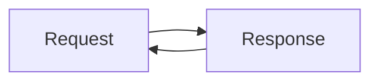
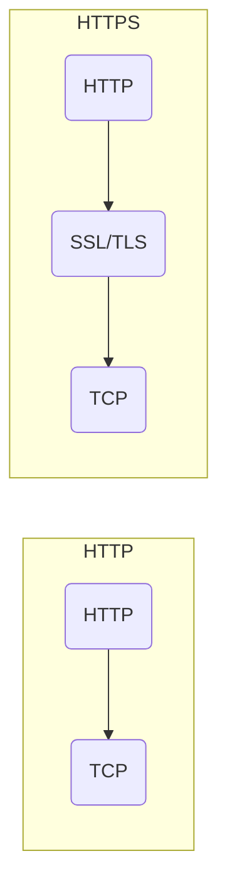
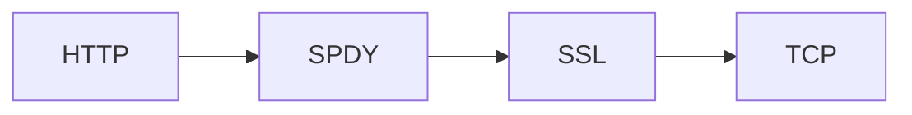

### 1. TCP和UDP的区别

| \\           | TCP                   | UDP                                |
| ------------ | --------------------- | ---------------------------------- |
| 是否连接     | 面向连接              | 无连接                             |
| 是否可靠     | 可靠                  | 不可靠                             |
| 连接对象个数 | 1对1                  | 1对1 或1 对多                      |
| 传输方式     | 面向字节              | 面向报文                           |
| 首部开销     | 20字节                | 8字节                              |
| 使用场景     | 可靠传输,如: 文件传输 | 实时应用(IP电话、视频会议、直播等) |

### 2. WebSocket

(1)什么是WebSocket?
WebSocket是HTML5中的协议,支持持旧连接,http协议不支持持久性连接.http1.0和http1.1都不支持持久性的连接,http1.1中的keep-alive,将多个http请求合并为1个

(2)WebSocket是什么样的协议,具有什么优点?

HTTP的声明周期通过Request来界定,也就是: 一个Request对应一个Response



- 在http1.0中,一个一个Request和一个Response之后,这次HTTP请求就结束了
- 在http1.1中,有一个`connection: Keep-alive`, 表示在一次HTTP连接中,可以发送多个Request和接收多个Response(注意一个Request对应一个Response)

WebSocket是基于HTTP协议的,请求的基本格式如下:

```http
GET / chat HTTP/1.1
Host: server.example.com
Upgrade: websocket
Connection: Upgrade
Sec-WebSocket-Key: x3JJHMbDL1EzLkh9GBhXDw==
Sec-WebSocket-Protocol: chat, superchat
Sec-WebSocket-Version: 13
Origin: http://example.com
```

多出了下面2个属性:

```http
Upgrade: webSocket
Connection: Upgrade
```

告诉服务器发送的是websocket

```http
Sec-WebSocket-Key: x3JJHMbDL1EzLkh9GBhXDw==
Sec-WebSocket-Protocol: chat, superchat
Sec-WebSocket-Version: 13
```

(3)[WebSocket 教程](http://www.ruanyifeng.com/blog/2017/05/websocket.html)

#### 为什么需要WebSocket?

- 初次接触WebSocket的,都会问同样的问题: 我们已经有了HTTP协议,为什么还需要另一个协议? 它能带来什么好处?
  - 因为HTTP协议有一个缺陷: 通常只能由客户端发起
  - 服务器做不到主动向客户端推送信息
  - 这种单向请求的特点,注定了如果服务器有连续的状态变化,客户端要获知就非常麻烦。我们只能用"轮询":每隔一段时间,就发一个询问,了解服务器有没有最新的信息(典型的场景就是聊天室)
  - 轮询的效率非常低,于是WebSocket就是这样诞生了

#### WebSocket协议的特点

WebSocket协议在2008年诞生,2011年成为国际标准.所有浏览器都已经支持了

它最大的特点就是,服务器可以主动向客户端推送信息,客户端也可以主动向服务器发送信息

其他特点包括:

(1)建立在TCP协议之上,服务端的实现比较容易

(2)与HTTP协议有着良好的兼容性。默认端口也是80和443,并且握手阶段采用HTTP协议,因此握手时不容易屏蔽,能通过各种HTTP代理服务器

(3)数据格式比较轻量,性能开销小,通信高效

(4)可以发送文本,也可以发送二进制数据

(5)没有同源限制,客户端可以与任意服务器通信

(6)协议标识符是ws

```ks
ws://example.com:80/some/path
```

#### 客户端简单示例

```js
var ws = new WebSocket("wss://echo.websocket.org");

ws.open = function(evt){
    console.log('Connection open')
    ws.send('Hello WebSockets！')
};

ws.onmessage = function(evt) {
    console.log('Received Message: ' + evt.data);
    ws.close()
}

ws.onclose = function(evt) {
    console.log('Connection closed')
}
```

### 3. 几个很实用的BOM属性对象方法

- 什么是BOM: Bom是浏览器对象,

#### 1.location

| 值                 | 含义                                                         |
| ------------------ | ------------------------------------------------------------ |
| location.href      | 返回或设置当前文档的URL                                      |
| location.search    | 返回URL中的查询字符串部分                                    |
| location.hash      | 返回URL#后面的内容                                           |
| location.host      | 返回URL中的域名部分                                          |
| location.hostname  | 返回URL中的主域名部分                                        |
| location.pathname  | 返回URL中的域名后的部分                                      |
| location.port      | 返回URL中的端口部分                                          |
| location.protocol  | 返回URL中的协议部分                                          |
| location.assign    | 设置当前的文档                                               |
| location.replace() | 设置当前文档的URL,并且在history对象的地址列表中移除这个URL location.replace(url) |
| location.reload()  | 重载当前页面                                                 |

#### 2.history对象

| 值                | 含义                   |
| ----------------- | ---------------------- |
| history.go()      | 前进或后退指定的页面数 |
| history.back()    | 后退一页               |
| history.forward() | 前进一页               |

#### 3. Navigator对象

| 值                      | 含义                       |
| ----------------------- | -------------------------- |
| navigator.userAgent     | 返回用户代理头的字符串表示 |
| navigator.cookieEnabled | 返回浏览器是否支持cookie   |

### 4. 说一下HTML drag api

| 值        | 含义                                                  |
| --------- | ----------------------------------------------------- |
| dragstart | 事件主体是被拖放元素,在开始拖放元素时触发             |
| drag      | 事件主体是拖放元素,在正在被拖放元素时触发             |
| dragenter | 事件主体是目标元素,在被拖放元素进入某元素时触发       |
| dragover  | 事件主体是目标元素,在被拖放在某元素内移动时触发       |
| dragleave | 事件主体是目标元素,在被拖放元素移出目标元素时触发     |
| drop      | 事件主体是目标元素,在目标元素完全接受被拖放元素时触发 |
| dragend   | 事件主体是被拖放元素,在整个拖放操作结束时触发         |

【小栗子】: 将本地图片拖放至浏览器中

```html
<!DOCTYPE html>
<html>
    <head>
        <meta charset="UTF-8">
        <title>拖动一张图片到浏览器中来</title>
        <style>
            body{
                text-align: center;
            }
            #container{
                border: 1px solid #aaa;
                border-radius: 3px;
                padding: 10px;
                margin: 10px;
                min-height: 400px;
            }
        </style>
    </head>
    <body>
        <h1>拖放API的扩展知识</h1>
        <h3>请拖动您的照片到下方方框区域</h3>
        <div id="container"></div>
    </body>
    <script>
        var container = document.getElementById('container');
        document.ondragover = function(e){
            e.preventDefault()
        }
        document.ondrop = function(e){
            e.preventDefault()
        }
        container.ondragover = function(e){
            e.preventDefault()
        }
        container.ondrop = function(e){
            var paper = e.dataTransfer.files[0];
            var file = new FileReader();
            file.readAsDataURL(paper)
            file.onload = function(){
                console.log('文件读取完成')
                console.log(file.result);
                var img = new Image();
                img.src = file.result;
                container.appendChild(img)
            }
        }
    </script>
</html>
```

### 5. http2.0

- [参考](https://juejin.im/entry/5981c5df518825359a2b9476)

#### 5.1 HTTP的历史

- 早在HTTP建立之初,主要是为了将超文本标记语言(HTML)从Web服务器传送到客户端的浏览器
- 对于前端来说,我们写好的HTML页面是放在web服务器上的,用户通过浏览器访问URL来获取网页的显示内容
- 但是到了WEB2.0以来,我们的页面变得复杂,不仅仅单纯的是一些简单的文字和图片,同时我们的HTML页面有了CSS,JavaScript,来丰富我们的页面展示
- 当ajax的出现,我们又多了一种向服务器端获取数据的方法,这些其实都是基于HTTP协议的.
- 同样到了移动互联网时代,我们页面可以跑在手机端浏览器里面,但是和PC端相比,手机端的网络情况更加复杂,这使得我们不得不对HTTP进行深入理解并不断优化

#### 5.2 HTTP的基本优化

影响一个HTTP网络请求的因素主要有两个: 带宽和延迟

- 带宽: 现在互联网基础设施已经使得带宽极大的提升,我们不再会担心由带宽而影响网速
- 延迟:
  - 浏览器阻塞(HOL blocking): 浏览器会因为一些原因阻塞请求.浏览器对于同一个域名,同时只能有4个连接,超过浏览器最大连接数限制,后续请求将会被阻塞
  - DNS查询(DNS Lookup): 浏览器需要知道目标服务器的IP才能建立连接.将域名解析为IP的这个系统就是DNS.这个通常可以利用DNS缓存来达到减少这个时间的目的
  - 建立连接(initial connection): HTTP是基于TCP协议的,浏览器最快也要在三次握手时才能捎带HTTP请求报文,达到真正的建立连接,但是这些连接无法复用会导致每次请求都经历三次握手和慢启动.三次握手在高延迟下影响较明显,慢启动则对文件类大请求影响较大

#### 5.3 HTTP1.0和HTTP1.1的一些区别

- <b>缓存处理</b>,在HTTP/1.0中主要使用header里的`if-modified-since, exprires`来为缓存判断标准,HTTP/1.1则引入了更多的缓存控制策略例如`Entity tag, if-unmodified-since, if-match, if-none-match`等更多可供选择的缓存来控制缓存策略
- <b>带宽优化及网络连接的使用</b>,在HTTP/1.0中,存在一些浪费带宽的现象,例如客户端只是需要某个对象的一部分,而服务器却将整个对象送过来了,并且不支持断点续传功能,HTTP1.1则在请求头引入了range头域,它允许只请求资源的某个部分,即返回码是206(Partial Content),这样就方便了开发者自由的选择以便于充分利用带宽和连接
- <b>错误通知的管理</b>,在HTTP/1.1中新增了24个错误状态响应码,如406(Confict)表示请求的资源与资源的当前状态发生冲突; 410(Gone)表示服务器上的某个资源被永久性的删除
- <b>Host头处理</b>,在HTTP/1.0中认为每台服务器都绑定一个唯一的IP地址,因此,请求消息中的URL并没有传递主机名(hostname).但随虚拟主机技术的发展,在一台物理服务器上可以存在多个虚拟主机(Muti-homed Web Server),并且它们共享一个IP地址。HTTP/1.1的请求消息和响应消息都应支持Host头域,且请求消息中没有Host头域会报告一个错误(400 Bad Request)
- <b>长连接</b>,HTTP/1.1 支持长连接(PersistentConnection)和请求的流水线(Pipelining)处理,在一个TCP连接上可以传送多个HTTP请求和响应,减少了建立和关闭连接的消耗和延迟,在HTTP/1.1中默认开启`Connection: keep-alive`,一定程度上弥补了HTTP/1.0每次请求都要创建连接的缺点


#### 5.4 HTTPS与HTTP的区别

- HTTPS协议需要到CA申请证书,一般免费证书很少,需要缴费
- HTTP协议运行在TCP之上,所有传输的内容都是明文,HTTPS运行在SSL/TLS之上,SSL/TLS运行在TCP之上,所有传输的内容都经过加密的
- HTTP和HTTPS使用的是完全不同的连接方式,用的端口也不一样,前者是80,后者是443
- HTTPS可以有效的防止运营商劫持,解决劫持的一大问题



#### 5.5 SPDY:  HTTP/1.x 的优化

2012年google如一声惊雷提出了SPDY的方案,优化了HTTP/1.X的请求延迟,解决了HTTP/1.X的安全性问题:

- <b>降低延迟</b>,针对HTTP高延迟的问题,SPDY优雅的采用了多路复用(multiplexing).多路复用通过多个请求stream共享一个tcp的连接方式,解决了浏览器阻塞(HOL blocking)的问题,降低了延迟同时提高了带宽利用率
- <b>请求优先级</b>(request priorization).多路复用带来了一个新的问题是,在连接共享基础之上有可能会导致关键连接被阻塞。SPDY允许给每个request设置优先级,这样重要的请求就会优先得到响应.比如浏览器加载首页,首页的html内容应该优先展示,之后才是各种静态资源文件,脚本文件等加载,这样可以保证用户能第一时间看到页面内容
- <b>header压缩</b>.选择了合适的算法较少包的大小和数量
- <b>基于HTTPS的加密协议传输</b>,大大提高了传输数据的可靠性
- <b>服务器推送(server push)</b>,采取了SPDY的网页,例如我的网页有一个style.css的请求,在客户端收到style.css的时候,服务器会将style.js的文件推送给客户端.当客户端再次尝试获取style.js时就可以直接从缓存中获取到,不用再发请求了.



#### 5.6 HTTP/2.0

HTTP/2.0 可以说是SPDY的升级版(基于SPDY设计的),但是HTTP/2.0跟SPDY也有不同的地方,如下:

- HTTP/2.0 支持明文HTTP传输,而SPDY强制使用HTTPS
- HTTP/2.0 消息头的压缩算法采用HPACK,而非SPDY采用的DEFLATE

#### 5.7 HTTP/2.0 和 HTTP/1.x 相比的新特性

- <b>新的二进制格式</b>(Binary Format),HTTP/1.x 的解析是基于文本。基于文本协议的格式解析存在天然缺陷，文本的表现形式有多样性,要做到健壮性考虑的场景必然很多,二进制则不同,只认0和1的组合.基于这种考虑,HTTP/2.0 的协议决定采用二进制格式,实现方便且健壮
- <b>多路复用</b>(MultiPlexing),即连接共享,即每一个request都是用作连接共享机制.一个request对应一个id,这样一个连接上可以有多个request,每个连接的request可以随机的混杂在一起,接收方可以根据request的id将request再归属到各自不同的服务端请求里面
- <b>header压缩</b>,如上文中所言,对前面提到过HTTP/1.x的header带有大量信息,而且每次都要重复发送,HTTP2.0使用encoder来减少需要传输的header大小,通讯双方各自cache一份header fields表,既避免header的传输,又减少了需要传输的大小.
- <b>服务端推送</b>(server push),同SPDY一样,HTTP/2.0也具有server push功能.

### 6. 状态码: 400、401和403

(1) 400(Bad Request): 告诉客户端,它发送了一条异常请求

(2) 401(unauthorized): 表示发送的请求需要有通过HTTP认证的认证信息

(3) 403(forbidden): 表示对请求资源的访问被服务器拒绝

### 7. 跨域资源共享CORS详解

- [跨域资源共享 CORS 详解 - 阮一峰](http://www.ruanyifeng.com/blog/2016/04/cors.html)

CORS是一个W3C标准,全称是"跨域资源共享"(Cross-Origin resource sharing)

它允许浏览器向跨源服务器发出XMLHttpRequest请求,从而客服AJAX只能同源使用的限制

#### 7.1 简介

- CORS需要浏览器和服务端同时支持(目前,所有浏览器都支持该功能)
- 整个CORS通信过程,都是浏览器自动完成,不需要用户参与.对于开发者来说,CORS通信与同源的AJAX通信几乎没有差别,代码完全一样.浏览器一旦发现AJAX请求跨域,就会自动添加一些附加的头信息,有时会多出一次附加请求,但用户不会有感觉
- 因此,实现CORS通信的关键是服务器端.只要服务器端实现了CORS接口,就可以跨院通信


#### 7.2 两种请求

浏览器将CORS请求分为两类: 简单请求(simple request) 和 非简单请求(not-so-simple request),只要同时满足以下两大条件,就属于简单请求:

```js
(1) 请求方法是以下三种方法之一:
 - HEAD
 - GET
 - POST
(2) HTTP的头信息不超过以下几种字段:
 - Accept
 - Accept-Language
 - Content-Language
 - Last-Event-ID
```

#### 7.3 简单请求

1. 基本流程

- 对于简单请求,浏览器直接发出CORS请求.具体来说,就是在头信息之中,增加一个Origin字段.

- 下面是一个小栗子: 浏览器发现这次跨源AJAX请求是简单请求,就自动在头信息中,添加一个Origin字段.

```js
GET /cors HTTP/1.1
Origin: http://api.bob.com
Host: api.alice.com
Accept-Language: en-US
Connection: keep-alive
User-Agent: Mozilla/5.0...
```

- 上面头信息中,Origin字段用来说明,本次请求来自哪个源(协议 + 域名 + 端口).服务器根据这个值,决定是否同意这次请求
- 如果Origin指定的源,不在许可范围内,服务器会返回一个正常的HTTP响应.浏览器发现,这个回应的头信息没有包含`Access-Control-Allow-Origin`字段(详见下文),就知道错了,从而抛出一个错误,被XMLHttpRequest的onerror回调函数捕获。注意,这种错误无法通过状态码识别,因为HTTP回应的状态码可能是200.
- 如果Origin指定的域名在许可范围内,服务器返回的响应,会多出几个头信息字段.

```js
Access-Control-Allow-Origin: http://api.bob.com
Access-Control-Allow-Credentials: true
Access-Control-Expose-Headers: FooBar
Content-Type: text/html; charset=utf-8
```

上面的头信息之中,有三个与CORS请求相关的字段,都以Access-Control开头

(1) <b>Access-Control-Allow-Origin</b>

该字段是必须的。它的值要么是请求时Origin字段的值,要么是一个*,表示接受任意域名的请求.

(2) <b>Access-Control-Allow-Credentials</b>

该字段可选.它的值是一个布尔值,表示是否允许发送Cookie.默认情况下,Cookie不包括在CORS请求之中。设为true,即表示服务器明确许可,Cookie可以包含在请求中,一起发送给服务器。这个值也只能设为true,如果服务器不要浏览器发送Cookie,删除该字段即可

(3) <b>Access-Control-Expose-Headers</b>

该字段可选.CORS请求时,XMLHttpRequest对象的getResponseHeader()方法只能拿到6个基本字段: `Cache-Control、Content-Language、Content-Type、Expires、Last-Modifie、Pragma`。如果想拿到其他字段,就必须在`Access-Control-Expose-Headers`里面指定。上面的栗子指定,getResponse('FooBar')可以返回FooBar字段。

2. withCredentials属性

上面说到,CORS默认不发送Cookie和HTTP认证信息。如果要把Cookie发到服务器,一方面要服务器同一,指定`Access-Control-Allow-Credentials`字段

```js
Access-Control-Allow-Credentials: true
```

另一方面,开发者必须在Ajax请求中打开`withCredentials`属性

```js
var xhr = new XMLHttpRequest();
xhr.withCredentials = true;
```

否则,即时服务器同意发送Cookie,浏览器也不会发送。或者,服务器要求设置Cookie,浏览器也不会处理

但是,如果省略`withCredentials`设置,有的浏览器还是会一起发送Cookie.这时,可以显式关闭: `withCredentials`

```js
xhr.withCredentials = false;
```

需要注意的是,如果发送Cookie,`Access-Control-Allow-Origin`就不能设置为星号,必须指定明确的、与请求页面一致的域名。同时,Cookie仍然遵循同源政策,只有用服务器域名设置的Cookie才会上传,其他域名的Cookie并不会上传,且(跨源)原网页代码中的`document.cookie`也无法继续读取服务器域名下的Cookie

#### 7.4 非简单请求

1. 预检请求

- 非简单请求是那种对服务器有特殊要求的请求,比如请求方法是PUT或DELETE,或者Content-Type字段的类型是`application/json`

- 非简单请求的CORS请求,会在正式通信之前,增加一次HTTP查询请求,称为"预检"请求(preflight)
- 浏览器先询问服务器,当前页面所在的域名是否在服务器的许可名单之中,以及可以使用哪些HTTP动词和头信息字段.只有得到肯定答复,浏览器才会发出正式的`XMLHttpRequest`请求,否则就会报错

```js
var url = "http://api.alice.com/cors";
var xhr = new XMLHttpRequest();
xhr.open('PUT', url, true);
xhr.setRequestHeader('X-Custome-Header', 'value');
xhr.send();
```

- 上面代码中,HTTP请求的方法是PUT,并且发送了一个自定义头部信息`X-Custom-Header`
- 浏览器发现,这是一个非简单请求,就会自动发出一个"预检"请求,要求服务器确认可以这样请求.下面是这个"预检"请求的HTTP头信息

```js
OPTIONS /cors HTTP/1.1
Origin: http://api.bob.com
Access-Control-Request-Method: PUT
Access-Control-Request-Headers: X-Custom-Header
Host: api.alice.com
Accept-Language: en-US
Connection: keep-alive
User-Agent: Mozilla/5.0...
```

"预检"请求用的请求方法是`OPTIONS`,表示这个请求是用来询问的。头信息里面,关键字是Ori'gin,表示请求来自哪个源.除了`Origin`字段,"预检"请求的头部信息包括两个特殊字段

(1)`Access-Control-Request-Method`

该字段是必须的,用来列出浏览器的CORS请求会用哪些HTTP方法,上例是PUT

(2) `Access-Control-Request-Headers`

该字段是一个逗号分隔的字符串,指定浏览器CORS请求会额外发送的头信息字段,上例是`X-Custom-Header`

2. 预检请求的回应

服务器收到"预检"请求以后,检查了`Origin、Access-Control-Request-Method` 和 `Access-Control-Request-Headers`字段以后, 确认允许跨源请求,就可以做出回应

```js
HTTP/1.1 200 OK
Date: Mon, 01 Dec 2008 01:15:39 GMT
Server: Apache/2.0.61(Unix)
Access-Control-Allow-Origin: http://api.bob.com
Access-Control-Allow-Methods: GET, POST, PUT
Access-Control-Allow-Headers: X-Custom-Header
Content-Type: type/html; charset=utf-8
Content-Encoding: gzip
Content-Length: 0
Keep-Alive: timeout=2, max=100
Connection: Keep-Alive
Content-Type: text/plain
```

上面的HTTP回应中,关键的是`Access-Control-Allow`字段,表示`http://api.bob.com`可以请求数据。该字段也可以设为星号,表示同意任意跨域请求。

```js
Access-Control-Allow-Origin: *
```

如果浏览器否定了"预检"请求,会返回一个正常的HTTP回应,但是没有任何CORS相关的头部信息字段。这时,浏览器就会认定,服务器不会同意预检请求,因此触发一个错误,被XMLHttpRequest对象的onerror回调函数捕获.控制台会打印如下的报错信息.

```js
XMLHttpRequest cannot load http://api.alice.com
Origin http://api.bob.com.is not allowed by Access-Control-Allow-Origin.
```

服务器回应的其他CORS相关字段如下:

```js
Access-Control-Allow-Methods: GET, POST, PUT
Access-Control-Allow-Headers: X-Custom-Header
Access-Control-Allow-Credentials: true
Access-Control-Max-Age: 1728000
```

### 8. fetch发送2次请求的原因

参考回答:

fetch发送post请求的时候,总是发送2次,第一次状态码204,第二次才成功?

原因很简单,因为你用fetch的post请求的时候,导致fetch第一次发送一个Options请求,询问服务器是否支持修改的请求头,如果服务器支持,则在第二次中发送真正的请求.

### 9. HTML 5 Web存储

[参考](https://www.w3school.com.cn/html5/html_5_webstorage.asp)


<b>在客户端存储数据</b>

HTML5提供了两种在客户端存储数据的新方法:

- localStorage - 没有时间限制的数据存储
- sessionStorage - 针对一个session的数据存储

之前,这些都是由cookie完成的.但是cookie不适合大量数据的存储,因为它们由每个对服务器的请求来传递,这使得cookie速度很慢而且效率也不高

在HTML5中,数据不是由每个服务器请求传递的,而是只有在请求时使用数据。它使在不影响网站性能的情况下存储大量数据成为可能。

对于不同的网站,数据存储于不同的区域,而且一个网站只能访问其自身的数据。

HTML5使用JavaScript来存储和访问数据


<b>localStorage方法</b>

`localStorage`方法存储的数据没有时间限制。

- 基本使用

```js
localStorage.lastname = "Smith";
document.write(localStorage.lastname);
```

- 对用户访问页面的次数

```js
if(localStorage.pagecount){
    localStorage.pagecount = Number(localStorage.pagecount) + 1;
} else {
    localStorage.pagecount = 1;
}
document.write('Visit ' + localStorage.pagecount + 'itme(s).');
```


<b>sessionStorage方法</b>

sessionStorage方法针对一个session进行数据存储.当浏览器关闭后,数据会被删除

```js
sessionStorage.lastname = 'Smith';
document.write(sessionStorage.lastname);
```


### 10. Cookie, LocalStorage 与 SessionStorage的区别

<b>Cookie</b>

cookie数据始终在同源的http请求中携带(即时不需要),即cookie在浏览器和服务器间来回传递.而sessionStorage和localStorage不会自动把数据发给服务器,仅在本地保存.cookie数据还有路径的概念,可以限制cookie只属于某个路径下,存储的大小很小只有4K左右


<b>sessionStorage 和 localStorage</b>

仅在当前浏览器关闭前有效(客户端内存中),自然也不可能持旧保持,localStorage:始终有效,窗口或浏览器关闭也一致保存,因此用作持久数据;cookie只在设置的cookie过期之前一直有效,即使窗口或浏览器关闭

localStorage和cookie在所有同源窗口中都是共享的.


### 11. web worker - 浅谈

[参考](https://juejin.im/post/5c10e5a9f265da611c26d634)

<b> 前言 </b>

众所周知,JavaScript是运行在单线程环境中,也就是说无法同时运行多个脚本.假设用户点击一个按钮,触发了一段用于计算的JavaScript代码,那么在这段代码执行完毕之前,页面无法响应用户的操作.但是,如果将这段代码交给Web Wroker去运行的话,那么情况就又不一样了: 浏览器会在后台启动一个独立的worker线程去专门负责访问这段代码的运行,因此,页面在这段JavaScript代码运行期间依然可以响应用户的其他操作.


<b>Web Worker 简介</b>

Web Worker是HTML5标准的一部分,这一规范定义了一套API,它允许一段JavaScript程序运行在主线程之外的另一个线程中.

值得注意的是,Web Worker规范中定义了两类工作线程:Dedicated Worker(供单个页面使用) 和 共享线程 Shared Worker(供多个页面共享使用).

> talk is cheap, show me the code


<b>用途</b>

Web Worker 的意义在于可以将一些耗时的数据处理操作从主线程中剥离,使主线程更加专注页面渲染和交互

- 懒加载
- 文本分析
- 流媒体数据处理
- canvas图形绘制
- 图像处理


<b>需要注意的点</b>

- 由同源限制
- 无法访问DOM节点
- 运行在另一个上下文中,无法使用Window对象
- Web Worker的运行不会影响主线程,但与主线程交互时,仍然会受到主线程单线程的瓶颈制约.换言之,如果Worker线程频繁与主线程进行交互,主线程由于需要处理交互,仍有可能使页面发生阻塞
- 共享线程可以被多个浏览器上下文(Browsing context)调用,但所有这些浏览上下文必需同源


<b>线程创建</b>

- 专用线程由`Worker()`方法创建,可以接收两个参数,第一个参数是必填的脚本的位置,第二个参数是可选的配置对象

```js
var worker = new Worker('worker.js')
```

- 共享线程使用`SharedWorker()`方法创建

```js
var sharedWorker = new SharedWorker('shared-worker.js')
```


<b>数据传递</b>

Worker线程和主线程通过`postMessage()`方法发送消息,通过`onmessage`事件接收消息

```js
// 主线程
var worker = new Worker('worker.js')
worker.postMessage([10, 24])
worker.onmessage = function(e) {
    console.log(e.data)
}

// Worker 线程
onmessage = function (e) {
    if (e.data.length > 1) {
        postMessage(e.data[1] - e.data[0])
    }
}
```

【问答】:

1. 如何创建web worker:

```js
var worker = new Worker('worker.js');
worker.postMessage([10, 24]);
worker.onmessage = function(e){
    console.log(e.data)
}
```

2. 检测浏览器对于web worker的支持性

```js
if(window.worker){
	// 检测专用线程
}
if(window.SharedWorker){
    // 检测共享线程
}
```

### 12. 对HTML语义化标签的理解

[参考 - 对HTML语义化的一些理解和记录](https://juejin.im/post/5ae029bcf265da0b7155f15d)

<b> 为什么要使用HTML语义化标签</b>

- 有利于搜索引擎的建立索引、抓取
- 便于不同设备的解析
- 结构更清晰,便于团队的维护和开发


### 13. Doctype


<b>Doctype作用</b>

`<!DOCTYPE>`声明位于HTML文档中的第一行,处于html标签之前,用于告知浏览器的解析器用什么文档标准(标准模式和混杂模式)解析这个文档.


<b>标准模式</b>

标准模式的排版和JS运作模式都是以浏览器支持的最高标准运行


<b>混杂模式</b>

向后兼容,模拟老式浏览器,防止浏览器无法兼容页面


<b>标准模式与混杂模式的区分</b>

- 如果HTML文档包含形式完整的DOCTYPE,那么他一般以标准模式呈现.

- 对于HTML4.01文档,包含严格DTD的DOCTYPE常常导致页面以标准模式呈现,DOCTYPE不存在或者格式不正确会导致文档以混杂模式呈现


### 14. Cookie如何防范XSS攻击

[参考](https://www.imooc.com/video/14368)

<b>XSS的攻击手段</b>

- 反射型
  - 发出请求时,XSS代码出现在URL中,作为输入提交到服务器端,服务器端解析后响应,XSS代码随响应内容一起传回给浏览器,最后浏览器解析并执行XSS代码.这个过程像一次反射,故叫反射性XSS。
  - 响应路由,并关闭浏览器的XSS拦截

```html
// index.art
<body>
  <index class="">
    <%- xss %>
  </index>
</body>
```

```js
// 使用的是express框架
router.get('/',function(req, res, next){
    res.set('X-XSS-Protection', 0);
    res.render('index',{
        xss: req.query.xss
    })
})

```

1. 直接触发

```js
// 就浏览器的URL地址栏中输入
localhost:3000/?xss=
```

2. 引诱触发

```js
http://localhost:3000/?xss=<p onclick="alert('你中了xss')">面试必中的秘密...</p>
```

3. 在页面中嵌套iframe - 可以通过这种方式在网页中插入各种广告.

```js
http://localhost:3000/?xss=<iframe src="http://www.baidu.com/t.html"></iframe>
```

- 存储型
  - 存储型XSS和反射型XSS的差别仅在于,提交的代码会存储在服务器端(数据库,内存,文件系统等),下次请求目标页面时不用再提交XSS代码

<b>掌握XSS的防御措施</b>

- 编码

| 字符                           | 十进制  | 转义字符 |
| ------------------------------ | ------- | -------- |
| "                              | &#34 ;  | &quot ;  |
| &                              | &#38 ;  | &amp ;   |
| <                              | &#60 ;  | &lt ;    |
| >                              | &#62 ;  | &gt ;    |
| 不断开空格(non-breaking space) | &#160 ; | &#nbsp ; |

- 过滤
  - 移除用户上传的DOM属性,如onerror等
  - 移除用户上传的Style属性、Script节点、Iframe节点等
- 校正
  - 避免直接对HTML Entity解码
  - 使用DOM Parse转换,校正不匹配的DOM标签
  -

<b>[httpOnly的样式设置](https://blog.csdn.net/qq_38553333/article/details/80055521)</b>

```js
// 设置cookie
response.addHeader('Set-Cookie','uid=112; Path=/; HttpOnly');

// 设置多个cookie
response.addHeader('Set-Cookie','uid=112; Path=/; HttpOnly');
response.addHeader('Set-Cookie','timeout=30; Path=/test; HttpOnly');

// 设置https的cookie
response.addHeader('Set-Cookie', 'uid=112; Path=/; Secure; HttpOnly');

// 设置HttpOnly属性后,通过js脚本是读取不到cookie,可以通过以下方式读取
Cookie cookies[] = request.getCookie();
```


<b>cookie如何防范XSS攻击</b>

XSS(跨站脚本攻击)是指攻击者再返回的HTML中嵌入javascript脚本,为了减轻这些攻击,需要再HTTP头部配上:

```js
set-cookie: httponly
```

> <b>HTTPOnly</b>这个属性可以防止XSS,它会禁止javascript脚本来访问cookie
>
> <b>secure</b>这个属性告诉浏览器仅在请求为https的时候发送cookie


