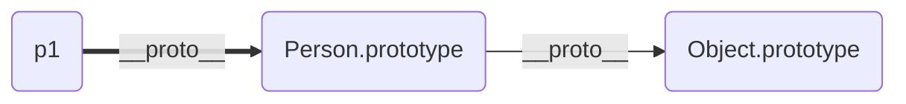

# 面试官问: 你了解HTTP2.0吗?

[参考](https://juejin.im/post/5c0ce870f265da61171c8c66)

<b>HTTP发展史</b>

- HTTP/0.9 - 单行协议
  - 问世于1990年,那时的HTTP非常简单: 只支持GET方法; 没有首部; 只能获取纯文本
- HTTP/1.0 - 搭建协议的框架
  - 1996年,HTTP正式被作为标准公布,版本为HTTP/1.0。1.0版本增加了首部、状态码、权限、缓存、长连接(默认短连接)等规范,可以说搭建了协议的基本框架。
- HTTP/1.1 - 进一步完善
  - 1997年,1.1版本接踵而至。1.1版本的重大改进在于默认长连接; 强制客户提供Host首部;管线化;Cache-Control、ETag等缓存的相关扩展
    - 注: Etag和Last-Modified同时存在,以Etag为主


【HTTP/1.0的缺陷】:

1. 连接无法复用: 一个连接对应一次握手
2. 队头阻塞: 前面一个连接未完成,后面的连接无法进行


对于问题1, HTTP/1.1新增了一个`connection: keep-alive`,使连接完成后不断开.


<b>目前存在的问题</b>

​	我们先来看看HTTP发展到1.1存在的问题:

1. 线头阻塞: TCP连接上只能发送一个请求,前面的请求未完成前,后续的请求都在排队等待.
2. 多个TCP连接:
   - 虽然HTTP/1.1管线化可以支持请求并发,但是浏览器很难实现,chrome、firefox等都禁用了管线化.所以1.1版本请求并发依赖于多个TCP连接,建立TCP连接成本很高,还回存在慢启动的问题.
3. 头部冗余,采用文本格式
   - HTTP/1.X版本是采用文本格式,首部未压缩,而且每一个请求都会带上cookie、user-agent等完全相同的首部
4. 客户端需要主动请求


<b>HTTP/2.0中的一些重大改进</b>

HTTP2性能提升的核心就在于二进制分帧层。HTTP2是二进制协议,他采用二进制格式传输数据而不是HTTP/1.x的文本格式

- 1.1响应是文本格式,而2.0把响应划分为两个帧
  - HEADERS frame: 首部
  - DATA frame: 消息负载

- 也就是说: 一条HTTP响应,划分为两个帧来传输,并且采用二进制来编码
  - 流(Stream): 已经建立TCP连接上的双向字节流,可以承载一个或多个消息
  - 消息(Message): 一个完整的HTTP请求或响应,由一个或多个帧组成。特定消息的帧在同一个流上发送,这意味着一个HTTP请求或响应只能在一个流上发送.
  - 帧(Frame): 通信的基本单位。 一个TCP连接上可以由任意数量的流


<b>多路复用</b>

HTTP/2.0让所有的通信都在一个TCP连接上完成,真正实现了请求的并发.

HTTP/2.0建立一个TCP连接,一个连接上面可以有任意多个流(stream),消息分割成一个或多个帧在流里面传输。帧传输过去以后,再进行重组,形成一个完整的请求或响应。这使得所有的请求或响应都无法阻塞。


<b>头部压缩</b>

在1.X版本中,首部用文本格式传输,通常会给每个传输增加500~800字节的开销。大多数请求的首部字段是相同的(如cookie、user-agent等)。

HTTP2为此采用HPACK压缩格式来压缩首部,头部压缩需要在浏览器和服务器之间:

- 维护一份相同的静态字典,包含常见的头部名称,以及常见的头部名称和值的组合
- 维护一份相同的动态字典,可以动态的添加内容
- 通过静态Huffman编码对传输的首部字段进行编码


HTTP/2.0的静态字典,部分:

| Index | Header Name | Header Value |
| ----- | ----------- | ------------ |
| 1     | :authority  |              |
| 2     | :method     | GET          |
| 3     | :method     | POST         |
| 4     | :path       | /            |
| 5     | :path       | /index.html  |
| 6     | :schema     | http         |
| 7     | :schema     | https        |
| 8     | :status     | 200          |
| 9     | :status     | 204          |

所以我们在传输首部字段的时候,例如要传输`method:GET`,那我们只需要传输静态字典里面`method: GET`对应的索引值就可以了,一个字节搞定.

像`user-agent、cookie`这种字典里面只有首部名称而没有值的首部,第一次传输需要`user-agent`在静态字典中的索引以及他的值,值会采用Huffman编码来减小体积

第一次传输过`user-agent`之后,浏览器和服务器就会把它添加到自己的动态字典中。后续传输就可以传输索引了,一个字节

<b>服务器推送技术</b>

- 服务器推送: 使得服务器可以预测客户端需要的资源,主动推送到客户端

- 例如: 客户端请求index.html,服务器端能够额外推送`script.js`和`style.css`.原理:
  - 客户端发送请求时,服务器能够分析这个页面所依赖的其他资源,主动推送到客户端的缓存
  - 当客户端收到原始网页的请求时,它需要的资源已经位于缓存


# 你真的了解回流和重绘吗?

[参考](https://segmentfault.com/a/1190000017329980) - 强烈推荐看看,这个作者写了很多特别好的文章.


<b>浏览器渲染过程</b>

1. 解析HTML,生成DOM树; 解析CSS生成CSSOM树
2. 将DOM树和CSSOM树合并,生成渲染(Render)树
3. Layout(回流): 根据生成的渲染树,视口(viewport),得到节点的几何信息(位置、大小)
4. Painting(重绘): 根据渲染树和几何信息得到节点的绝对像素
5. Display: 将像素发送给GPU,展示在页面上


<b>生成渲染树</b>


为了构建渲染树,浏览器主要完成了以下工作:

1. 从DOM树的根节点开始遍历每个可见节点
2. 对于每个可见的节点,找到CSSOM树中的规则,并应用它们
3. 根据每个可见节点及其对应的样式,组合生成渲染树


【不可见的节点】:

- 一些不会渲染输出的节点: 比如script、meta、link等
- 一些通过css进行隐藏的节点。比如display: none。注意,利用visibility和opacity隐藏的节点,还是会显示在渲染树上的。只有display:none的节点才不会显示在渲染树上


【注意】: 渲染树只包括可见的节点


<b>回流(Layout)</b>

前面将DOM节点以及它对应的样式结合起来,可是我们还需要计算它们在设备视口(viewport)内的确切位置和大小,这个计算的阶段就是回流。看下面的栗子:

```html
<!DOCTYPE html>
<html>
    <head>
        <meta name="viewport" content="width=device-width,initial-scale=1">
        <title>Cretical Path: Hello Marron!</title>
    </head>
    <body>
        <div style="width: 50%">
            <div style="width: 50%">Hi Marron, best wish!</div>
        </div>
    </body>
</html>
```

我们可以看到,第一个div将节点的显示尺寸设置为视口宽度的50%,第二个div将其尺寸设置为父节点的50%.而在回流这个阶段,我们就需要根据视口具体的宽度,将其转为实际的像素值。

​	


<b>重绘 (Painting)</b>

- 生成渲染树阶段: 我们直到了哪些节点是可见的以及可见节点的样式
- 在回流阶段: 我们得到了可见元素的具体几何信息

>我们得到的信息,最终都会托付给GPU进行渲染

GPU的渲染需要具体的像素位置,这就是重绘阶段所做的事情： 根据渲染树和几何信息计算出绝对像素点.


<b>何时发生回流重绘</b>

回流主要是计算节点的几何位置和几何像素大小.那么当页面布局和几何信息发生变化的时候,就需要回流:

- 添加或删除可见的DOM元素
- 元素的位置发生变化
- 元素的尺寸发生变化(内/外边距、边框大小、高度和宽度等)
- 内容发生: 文本发生变化或图片被另一个不同尺寸的图片所替代
- 页面刚开始渲染的时候
- 浏览器的窗口尺寸变化: 回流是根据视口的大小来计算元素的位置和大小的


> 经典老话: 回流一定重绘,重绘不一定回流


<b>浏览器的优化机制</b>

现代的浏览器都是很聪明的,由于每次重排都会造成造成额外的计算消耗,因此大多数浏览器都会通过队列修改、批量执行来优化重排过程。浏览器会将修改操作放在队列里,直到过了一段时间,或者操作达到一个阈值,才清空队列。

还有一些强制刷新的属性(避免使用):

- offsetTop、offsetLeft、offsetWidth、offsetHeight
- scrollTop、scrollLeft、scrollWidth、scrollHeight
- clientTop、clientLeft、clientWidth、clientHeight
- getComputedStyle()
- getBoundingClientRect
- ...


<b>前端优化</b>

1 -【并多次的DOM和添加样式】

```js
// 未优化前 - 3次
const el = document.getElementById('test')
el.style.padding = '5px';
el.style.borderLeft = '1px';
el.style.borderRight = '2px';

// 合并样式 - 1次
const el = document.getElementById('test');
el.style.cssText += 'border-left: 1px; border-right: 2px; padding: 5px'

// 添加样式 - 1次
const el = document.getElementById('test');
el.calssName += ' active';
```

2 -【脱离文档流】

当元素脱离文档流后,对元素的所有操作都不会引起回流和重绘.因此如果,对某个元素进行的DOM操作比较多的时候,可以先将元素脱离文档流,然后操作,最后在放回文档流。具体操作如下:

1. 使元素脱离文档流
2. 对其进行多次修改
3. 将元素带回到文档中.

[注] : 上述的1、3会引起回流和重绘.


【脱离文档流的方法】

- 隐藏元素,修改应用,重新显示
- 使用文档片段(document fragment)在使用DOM之外构建一个子树,再把它拷贝回文档
- 将原始元素拷贝到一个脱离文档的节点中,修改节点后,再替换原始的元素。


```js
// 每次插入li都会引起一次回流和重绘
function appendDataToElement(appendToElement, data) {
    let li;
    for(let i =0,len = data.length;i < len;i++){
        li = document.createElement('li');
        li.textContent = 'text';
        appendToElement.appendChild(li);
    }
}

const ul = document.getElementById('list');
appdenDataToElement(ul, data);
```

[隐藏元素]

```js
// 仅在隐藏元素和现实元素时产生2次回流和重绘
function appendDataToElement(appendToElement, data) {
    let li;
    for(let i =0, len = data.length; i < len; i++){
        li = document.createElement('li');
        li.textContent = 'text';
        appendTOElement.appendChild(li);
    }
}

const ul = document.getElementById('list');
ul.style.display = 'none';
appendDataToElement(ul, data);
ul.style.display = 'block';
```

[使用文档片段] - 在当前DOM外构建一个子树,再把它拷贝回文档

```js
const ul = document.getElementById('list');
const fragment = document.createDocumentFragment();
appendDataToElement(fragment, data);
up.appendChild(fragment);
```

[脱离文档] - 将原始元素拷贝到一个脱离文档的节点中,修改节点,再替换原始的元素。

```js
const ul = document.getElementById('list');
const clone = ul.cloneNode(true);
appendDataToElement(clone, data);
ul.parentNode.replaceChild(clone, ul);
```

[注] - 现代浏览器使用了队列来存储多次修改,因此上述的优化可能效果不是很理想.

3 - 【避免触发同步布局事件】

```js
// 栗子: 多次使用到 offsetWidth 属性
function initP(){
    for(let i = 0; i< paragraph.length; i++){
        paragraph[i].style.width = box.offsetWidth + 'px'
    }
}
```

上述代码每次循环,都会使浏览器强制刷新队列(`box.offsetWidth`),造成多次回流和重绘.改进如下:

```js
const width = box.offsetWidth;
function initP(){
    for(let i = 0; i < paragraph.length; i++){
        paragraph[i].style.width = width + 'px'
    }
}
```

4 - 【复杂动画的优化】

对于复杂动画效果,由于会经常的引起回流和重绘。因此,我们可以使用绝对定位,让它脱离文档流。否则会引起父元素以及后续元素频繁的回流 - [栗子]([https://chenjigeng.github.io/example/share/%E9%81%BF%E5%85%8D%E5%9B%9E%E6%B5%81%E9%87%8D%E7%BB%98/%E5%B0%86%E5%A4%8D%E6%9D%82%E5%8A%A8%E7%94%BB%E6%B5%AE%E5%8A%A8%E5%8C%96.html](https://chenjigeng.github.io/example/share/避免回流重绘/将复杂动画浮动化.html))


# 对MVVM的了解

MVVM是Model-View-ViewModel的缩写

<b>Model</b>代表数据模型,也可以在Model中定义数据修改和操作的业务逻辑

<b>View</b>代表UI组件,它负责将数据模型转化成UI展现出来

<b>ViewModel</b>监听模型数据的改变和控制视图的行为、处理用户交互,简单理解就是一个同步View和Model的对象,连接Model和View.

在MVVM架构下,View和Model之间并没有直接的联系,而是通过ViewModel进行交互,Model和ViewModel之间的交互是双向的,因此View数据的变化会同步到Model中,而Model数据的变化也会立即反应到View上

<b>ViewModel</b>通过双向数据绑定把View层和Model层连接了起来,而View和Model之间的同步工作完全是自动的,无需认为干涉,因此开发者只需关业务逻辑,不需要手动操作DOM,不需要关注数据状态的同步问题,复杂的数据状态维护完全由MVVM来统一管理

# Vue的生命周期

<b>beforeCreate</b>(创建前)在数据观测和初始化事件还未开始

<b>created</b>(创建后)完成数据观测,属性和方法的运算,初始化事件,$el属性还没有显示出来

<b>beforeMount</b>(载入前)在挂在开始之前被调用,相关的render函数首次被调用。实例已经完成以下的配置: 编译模板,把data里面的数据和模板生成生成html.注意,此时还没有挂在到html页面上

<b>mounted</b>(载入后)在el被新创建的vm.$el替换,并挂载到实例上去之后调用.实例已完成以下配置: 用上面编译好的html内容替换el属性指向的DOM对象。完成模板中的html渲染到html页面中。此过程进行ajax交互。

<b>beforeUpdate</b>(更新前)在数据更新之前调用,发生在虚拟DOM重新渲染和打补丁之前.可以在该钩子中进一步地更改状态,不会触发附加的重新渲染过程。

<b>updated</b>(更新后)在由于数据更改导致的虚拟DOM重新渲染和打补丁后调用。调用时,组件DOM已经更新,所以可能会导致更新无限循环.该钩子在服务器渲染期间不被调用.

<b>beforeDestroy</b>(销毁前)在实例销毁之前调用.实例仍然完全可用.

<b>destroyed</b>(销毁后)在实例销毁之后调用。调用后所有的事件监听器会被移除,所有的子实例也会被销毁。该钩子在服务器渲染期间不被调用


1. 什么是vue生命周期?

答: Vue实例从创建到销毁的过程,就是生命周期.从开始创建、初始化数据、编译模板、挂载DOM渲染、更新->渲染、销毁等一些列过程,称之为Vue的生命周期


2. 生命周期的作用是什么?

答: 它的生命周期中有多少个事件钩子,让我们在控制整个Vue实例的过程时更容易形成好的逻辑


3. vue生命周期总共有几个阶段?

答: 它可以总共分为8个阶段: 创建前/后,载入前/后,更新前/后,销毁前/后


4. 第一次页面加载会触发哪几个钩子?

答: 会触发下面几个beforeCreated,created,beforeMount,mounted


5. DOM渲染在哪个周期中就已经完成了?

答: DOM渲染在mounted中就已经完成了


# Vue实现数据双向绑定原理

vue实现数据双向绑定主要是: <b>采用数据劫持结合发布-订阅者模式的方式</b>,通过`Object.defineProperty()`来劫持各个属性的`setter、getter`,在数据变动时发布消息给订阅者,触发相应监听回调.当把一个普通JavaScript对象传给Vue实例来作为它的data选项时,Vue将遍历它的属性,用Objetc.defineProperty将它们转为getter/setter.用户看不到getter/setter,但是在内部,它们让Vue追踪依赖,在属性被访问和修改的时通知变化.


vue的数据双向绑定将MVVM作为数据绑定的入口,整合Observer,Compiler和Watcher三者,通过Observer来监听自己的model的数据变化,通过Compiler来解析编译模板指令(vue中是用来解析{{}}),最终利用watcher搭起observer和Compile之间的通信桥梁,达到数据变化 -> 视图更新;视图交互变化(input) -> 数据model变更双向绑定效果


<b>js实现简单的双向绑定</b>

```html
<body>
    <div id="app">
        <input type="text" id="txt">
    </div>
</body>
<script>
    var obj = {}
    var newObj = {}
    newObj = obj
    Object.difineProperty(obj, 'txt', {
        get: function(){
            return newObj
        },
        set: function()
    })
</script>
```

# 对象原型

[参考 - MDN](https://developer.mozilla.org/zh-CN/docs/Learn/JavaScript/Objects/Object_prototypes)

## Javascript中的原型

在Javascript中,每一个函数都有一个特殊的属性,叫做原型

下面获取函数的原型`fn.prototype`

```js
function f1(){}
console.log(f1.prototype)
/*
	{
		constructor: f f1()
		__proto__:{
			constructor: f Object()
			__defineGetter__: f __defineGetter__()
			__defineSetter__: f __defineSetter__()
			hasOwnProperty: f hasOwnProperty()
			__lookupGetter__: f __lookupGetter__()
			__lookupSetter__: f __lookupSetter__()
			isPrototypeOf: f isPrototypeOf()
			...
		}
	}
*/
```

下面给函数的原型添加属性`fn.prototype.hello = 'world'`

```js
function f1(){}
f1.prototype.hello = 'world'
console.log(f1.prototype)
/*
	{
		hello: "world"
		constructor: f f1()
		__proto__: Object
	}
*/
```

创建一个函数的实例`new fn()`,并给实例添加属性

```js
function Person(){}
Person.prototype.hello = 'world'
var p1 = new Person()
p1.say = 'hi'
console.log(p1)
/*
	{
		say: "Hi"
		__proto__:{
			hello: "world"
			constructor: f Person()
			__proto__: Object
		}
	}
*/
```

浏览器访问某个属性的寻找顺序:

- 首先会寻找这个实例是否含有该属性
- 如果有则返回,否则会通过`__proto__`寻找该实例的原型`Person.prototype`上是否含有该属性.
- 如果有则返回,否则会通过`__proto__.__proto__`的上寻找该属性.
- 如此循环.到最后`__proto__.__proto__. ... = undefined`则返回undefined

## 理解原型对象

下面定义一个构造器函数

```js
function Person(first, last, age, gender, interests){
    this.first = first
    this.last = last
    this.age = age
    this.gender = gender
    this.interests = interests
}
var p1 = new Person("Li","Bruce",18,'男','coding')
console.log(p1.__proto__ === Person.prototype) // true
console.log(p1.__proto__.__proto__ === Object.prototype) // true
console.log(p1)
/*
	{
		first: "Li"
		last: "Bruce"
		age: 18
		gender: "男"
		interests: "coding"
		__proto__:{
			constructor: f Person(first, last, age, gender, interests)
			__proto__:{
				constructor: f Object()
				__defineGetter__: f __defineGetter__()
				...
				valueOf: f valueOf()
				...
			}
		}
	}
*/
```

- 此时存在一条原型链:



此时,调用如下:

```js
p1.valueOf()
```

根据前面的规则:

- 浏览器首先检查,p1对象是否含有`valueOf()`方法
- 如果没有,则浏览器检查p1对象的原型对象(Person.prototype, 通过浏览器提供的`__proto__`访问)是否具有可用的`valueOf()`方法
- 如果还没有,浏览器会检查`Person()`构造函数的prototype属性所指向的对象的原型对象(Object.prototype)是否含有该方法,如果有则返回,否则返回undefined

> 原型链中的方法和属性没有被复制到其他对象 -- 它们被访问需要通过"原型链"的方式
>
> 官方并未提供`__proto__`属性,在JavaScript语言标准中用[[prototype]]表示.然而,大多数现代浏览器还是提供了一个名为`__proto__`的属性.


## prototype属性: 继承成员被定义的地方

查看[MDN - Object](https://developer.mozilla.org/zh-CN/docs/Web/JavaScript/Reference/Global_Objects/Object)可以看到,Object有很多属性,但是在上面的p1中,并不是全部都继承了.

原因在于: 被继承的属性仅仅只是定义在`Object.prototype`上的属性.定义在Object本身上的属性是不会被继承的

看下面的栗子:

```js
function Person(){}
console.log(Person.prototype)
/*
	{
		constructor: f Person()
		__proto__: Object
	}
*/
```

默认情况下,构造器(此处为Person)的`prototype`属性初始为空白.


## 静态成员与实例成员

- `静态成员`: 在构造函数本身上添加的成员
- `实例成员`: 构造函数内部通过this添加的成员,只能通过实例化的对象来访问

```js
function Person(name, age){
    this.name = name
    this.age = age
}
Person.sex = '男'
var p1 = new Person('Marron', 18)
// name、age就是实例成员
// sex就是静态成员
```

## 使用prototype的好处

节约内存.例如下述:

```js
function Person(name, age){
    this.name = name
    this.age = age
    this.sayHi = function(){
        console.log('Hi ~')
    }
}
var p1 = new Person('Mar', 18)
var p2 = new Person('Marron', 19)
```

上面通过构造函数,生成了2个实例化对象,但是两个实例化对象的方法的内存地址是不同的.

```js
console.log(p1.sayHi == p2.sayHi)  // false
```

引用prototype属性可以节约内存

```js
function Person(name, age){
    this.name = name
    this.age = age
}
Person.prototype.sayHi = function(){
    console.log('Hi ~')
}
var p1 = new Person('Mar', 18)
var p2 = new Person('Marron', 19)
console.log(p1.sayHi == p2.sayHi)  // true
p1.sayHi()	// "Hi ~"
```

- 可见构造函数通过`Person.prototype`类似构造的所有对象是共享的(同一个内存空间)

- javascript规定,每一个构造函数都有一个prototype属性,指向另一个对象.

# Vue中原型链的使用

在讨论Vue中原型链的使用之前,你需要理解[对象原型](https://blog.csdn.net/piano9425/article/details/104614697)

## Vue 2.x 响应式原理


