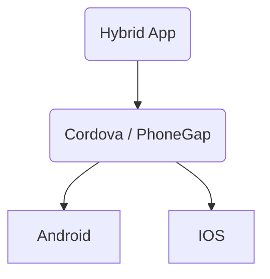
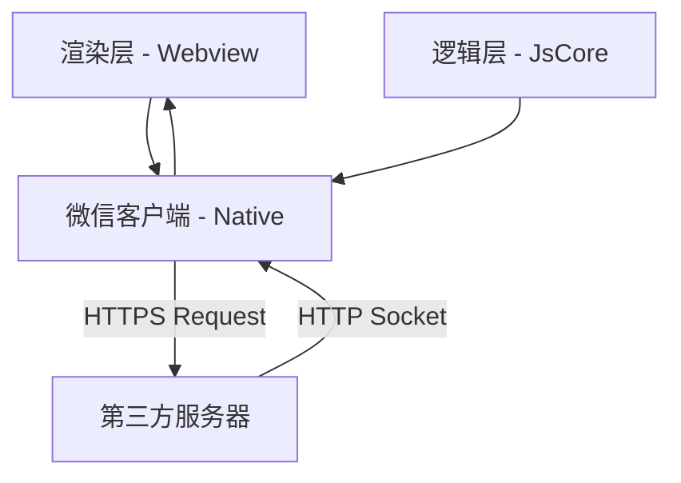
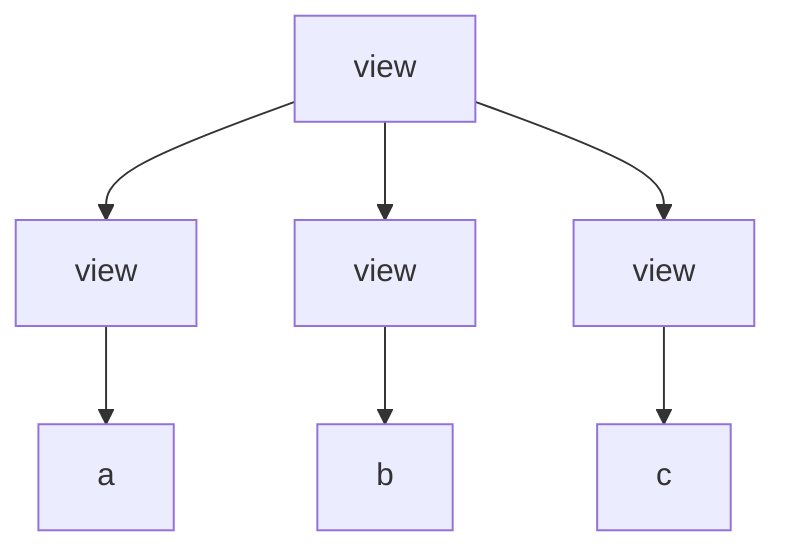
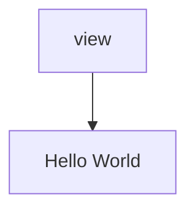
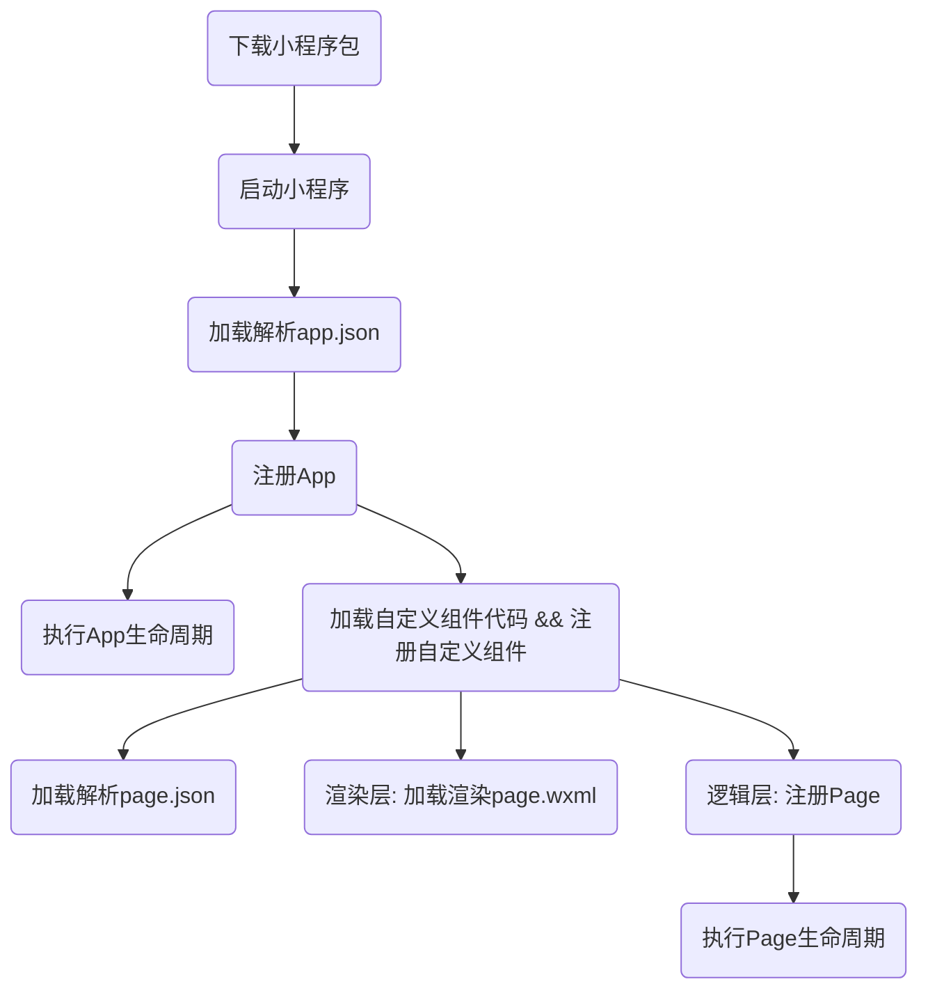

# 小程序
[地址](https://www.bilibili.com/video/av77952538?from=search&seid=1427872321881856703)

一种不需要下载安装即可使用的应用,它实现了应用"触手可及"的梦想,用户扫一扫或搜一下即可打开应用。也体现了"用完即走"的理念,用户不用关心是否安装太多应用的问题。应用将无处不在,随时可用,但又无序安装卸载



[微信小程序的特点] :

- 类似于Web开发模式,入门的门槛低: 基本上是类似于 html+css+js;
- 可直接云端更新: 微信审核,无需通过App Store等平台;
- 提升用户体验: 通过提供基础能力、原生组件结合等方式,提升用户体验;
- 平台管控能力: 小程序提供云端更新,通过代码上传、审核等方式,增强对开发者的管控能力;
- 双线程模型: 逻辑层和渲染层分开加载,提供了管控型和安全型(沙盒环境运行JS代码,不允许执行任务和浏览器相关的接口,比如跳转页面、操作DOM等);


### 1. 准备工作

- 登录[微信公众平台](https://mp.weixin.qq.com)

- 一个账户对应一个小程序
- 企业、政府、媒体、其他组织主体可用注册50个小程序;
- 个体户和个人类型主体可注册5个小程序


#### 1.  应用程序的结构

-  App: 整个小程序称为 app

- 一个App 包含 多个pages

- 每个page包含多个组件

  ```mermaid
  graph LR
  App(App)
  page1(Page1)
  page2(Page2)
  page3(Page3)
  com1(内置组件1)
  com2(内置组件2)
  com3(内置组件3)

  zdy1(自定义组件1)
  zdy2(自定义组件2)
  zdy3(自定义组件3)

  App --> page1
  App --> page2
  App --> page3
  page1 --> com1
  page1 --> zdy1
  page1 --> zdy2
  page2 --> com2
  page2 --> zdy3
  page3 --> com3
  page3 --> zdy3
  ```

  ```mermaid
  graph LR
  file[文件结构]
  app(App)
  page(Page)
  com(Component)
  appjs(app.js)
  appjson(app.json)
  appwxss(app.wxss)
  pagejs(page.js)
  pagejson(page.json)
  pagewxml(page.wxml)
  pagewxss(page.wxss)
  comjs(component.js)
  comjson(component.json)
  comwxml(component.wxml)
  comwxss(component.wxss)

  file --> app
  file --> page
  file --> com

  app -->|创建App实例的代码以及一些全局相关的内容| appjs
  app -->|全局的一些配置,比如window/tabber| appjson
  app -->|全局的一些样式配置| appwxss

  page --> |创建Page实例的代码,以及页面相关的内容| pagejs
  page --> |业务单独的配置,比如页面对应的window配置,usingComponents| pagejson
  page --> |页面的wxml布局代码| pagewxml
  page --> |页面的样式配置| pagewxss

  com --> |创建Component实例的代码,以及组件内部的内容| comjs
  com --> |组件内部的配置| comjson
  com --> |组件的wxml布局| comwxml
  com --> |组件的样式配置| comwxss
  ```


### 2. 多个项目管理方式

1. 进入项目根目录: `git init`
2. 将当前的项目添加到暂存区中: `git add .` (注意: 最后有一个点)

3. 将暂存区的内容放到本地仓库: `git commit -m '初始化项目'`

4. 登录[github](github.com) , 新建[远程仓库](https://github.com/Lizhhhh/miniProgram.git)

5. 在本地添加远程仓库的源: `git remote origin https://github.com/Lizhhhh/miniProgram.git`

6. 将本地代码提交到远程: `git push -u origin master`


#### 2.1 给提交的代码添加标签,并提交到远程

- 假设现在,我们在本地修改好了代码:

1. 将代码保存到暂存区 `git add .`
2. 暂存到本地: `git commit -m '知识点1'`
3. 上标记: `git tag 01_知识点1`
4. 通过`git tag`来查看项目中的标签. 

```git
$ git tag
01_知识点1
```

- 查看项目中有哪些提交: `git log`

```git
commit 75c6d6bdfa063322ce728b98ab4dc20724efc02d (HEAD -> master, tag: 01_知识点1)
Author: 栗子好好吃 <543288744@qq.com>
Date:   Sat Feb 15 13:58:23 2020 +0800

    知识点1

commit f98bf38a589ce6c696a844f41a81be9e554714ba (origin/master)
Author: 栗子好好吃 <543288744@qq.com>
Date:   Sat Feb 15 14:41:22 2020 +0800

    初始化项目
```

5. 找到项目初始化的id,然后进行版本回退: `git reset --hard f98bf38`

6. 此时项目处于初始化的状态.你可以对项目进行修改....
7. 修改完成后,将新的代码提交到本地:`git add .` -->  `git commit -m  '知识点2'` --> `git tab 02_知识点2`

8. 此时: `git tag`, 当前的代码仅在本地,而在远程中没有.下面需要将tags推到远程中

```git
$ git tag
01_知识点1
02_知识点2
```

9. `git push --tags`

```git
$ git push --tags
Enumerating objects: 14, done.
Counting objects: 100% (14/14), done.
Delta compression using up to 8 threads
Compressing objects: 100% (10/10), done.
Writing objects: 100% (10/10), 869 bytes | 434.00 KiB/s, done.
Total 10 (delta 6), reused 0 (delta 0)
remote: Resolving deltas: 100% (6/6), completed with 2 local objects.
To https://github.com/Lizhhhh/miniProgram.git
 * [new tag]         01_知识点1 -> 01_知识点1
 * [new tag]         02_知识点2 -> 02_知识点2
```

10. 此时可以在[git远程仓库](https://github.com/Lizhhhh/miniProgram.git)中的Branch中找到对应的tags.来完成项目的远程拷贝

#### 2.2 从远程将项目拷贝下来

1. 登录远程仓,找到克隆的地址: `https://github.com/Lizhhhh/miniProgram.git`

2. 将远程仓库的代码拷贝到本地: `git clone`

```git
$ git clone https://github.com/Lizhhhh/miniProgram.git
Cloning into 'miniProgram'...
remote: Enumerating objects: 26, done.
remote: Counting objects: 100% (26/26), done.
remote: Compressing objects: 100% (16/16), done.
remote: Total 26 (delta 8), reused 25 (delta 7), pack-reused 0
Unpacking objects: 100% (26/26), done.
```

3. 现在假设想查看`tag 01_知识点1`的代码,可以在命令行输入:`git checkout 01_知识点1`

```git
$ git checkout 01_知识点1
Note: checking out '01_知识点1'.

You are in 'detached HEAD' state. You can look around, make experimental
changes and commit them, and you can discard any commits you make in this
state without impacting any branches by performing another checkout.

If you want to create a new branch to retain commits you create, you may
do so (now or later) by using -b with the checkout command again. Example:

  git checkout -b <new-branch-name>

HEAD is now at 4e8281e 知识点1
M       app.json
M       project.config.json
```

4. 现在假设想查看`tag 02_知识点2`的代码,可以在命令行输入:`git checkout 02_知识点2`

### 3. 小程序初体验

- 先进行版本回退: `git reset --hard`

```git
$ git reset --hard f98bf38
HEAD is now at f98bf38 初始化项目
```

#### 3.1 小程序的数据绑定

```js
// home.js
Page({
  data:{
    name: 'Codewhy',
    age: '18'
  }
})
```

```html
// home.wxml
<!-- 1.小程序的数据绑定 -->
<view>Hello {{name}}</view>
<view>我的年龄 {{age}}</view>
```

#### 3.2 小程序的按钮事件绑定

```js
Page({
    handltBtnClick(){
        console.log('按钮发生了点击')
    }
})
```

```html
<button bindtap="handleBtnClick">+</button>
```

- 监听按钮的加1事件

```html
<!-- 3.事件监听改变data -->
<view>当前计数: {{counter}}</view>
<button bindtap="handleBtnClick">+</button>
```

```js
// 改变数据,要通过setData才能进行响应式变化
Page({
    handleBtnClick({
        this.setData({
       		counter: this.data.counter + 1
    	})
    })
})
```

#### 3.3 小程序的MVVM架构

- Vue中的MVVM架构: 
  - Model: 数据(网络请求的、静态的)
  - View: 用于显示的界面
  - VM(ViewModel): Data Bindings(数据绑定,根据数据渲染视图)、DOM Listeners(根据视图的变化,更改数据)
  - 在Vue中,VM的角色是由Vue来扮演的

- 小程序的MVVM架构:
  - VM是由MINA框架扮演的


- MVVM为什么好用?
  - DOM Listeners: ViewModel层可以将DOM的监听绑定到Model层
  - Data Bindings: ViewModel层可以将数据的遍历,响应式的反应到View层
- MVVM架构将我们从命令式编程转移到声明式编程


#### 3.4 编程范式

1. 命令式编程: 原生操作DOM

```html
<body>
    <h2 class="title"></h2>
    <button class="btn">按钮</button>
</body>
<script>
    let name = '哈哈';
    const $title = document.querySelector('.title');
    $title.textContent = name;
    const $btn = document.quertSelector('.btn');
    $btn.addEventListener('click',()=>{
        name='呵呵';
        $btn.textContent = name;
    })
</script>
```

2. 声明式编程:  Vue/React/Angular

```html
<body>
    <div id="app">
        <h2> {{title}} </h2>
        <button @click="btnClick"> 按钮 </button>
    </div>
    <script src="./lib/vue.js"></script>
    <script>
        new Vue({
            el: '#app',
            data: {
                title: '哈哈'
            },
            methods:{
                btnClick(){
                    this.title= "呵呵"
                }
            }
        })
    </script>
</body>
```

- 以上并无DOM操作.仅仅只是声明了数据和数据的显示

### 4. 小程序架构和配置

#### 4.1 配置小程序

- 小程序的很多开发需求被规定在了配置文件中

- 这样做的好处:

  - 有利于我们的开发效率
  - 保证开发出来的小程序的某些风格比较一致

- 常见的配置文件:

  - [project.config.json](https://developers.weixin.qq.com/miniprogram/dev/devtools/projectconfig.html) : 项目配置文件，ide会根据文件中的相关信息对项目的开发环境进行配置
  - [sitemap.json](https://developers.weixin.qq.com/miniprogram/dev/framework/sitemap.html) : 小程序搜索相关的

  ```js
  // 允许微信的爬虫爬取小程序中的所有页面
  {
      "rules":[{
          "action": "allow",
          "page": "*"
      }]
  }
  ```

  ```js
  // 配置 path/to/page 页面被索引，其余页面不被索引
  {
      "rules":[{
          "action": "allow",
          "page": "path/to/page"
      },{
          "action": "disallow",
          "apge:" "*"
      }]
  }
  ```

  - `app.json`: [全局配置](https://developers.weixin.qq.com/miniprogram/dev/reference/configuration/app.html)

    - `pages`: 页面路径列表

      - 用于指定小程序由哪些页面组成,每一项对应一个页面的路径信息
      - 小程序中所有的页面都是必须在pages中进行注册的

    - `window`: 全局的默认窗口展示,下面展示常用的

      - | 属性                         | 作用                      |
        | ---------------------------- | ------------------------- |
        | navigationBarBackgroundColor | tab栏的背景色             |
        | navigationBarTextStyle       | tab栏的字体颜色           |
        | navigationBarTitleText       | tab栏中的标题             |
        | backgroundColor              | tab栏下拉时候留白的背景色 |
        | backgroundTextStyle          | 设置下拉的闪动的样式      |
        | enablePullDownRefresh        | 是否可以向下拉动          |

    - tabBar:底部tab栏的展示

  - `page.json`: 页面配置

#### 4.2 小程序的双线程模型

- 宿主环境: 为了执行小程序的各种文件: wxml文件、wxss文件、js文件
- (微信客户端)提供了小程序的双线程模型


##### 4.2.1 双线程模型

- 渲染层: WXML模块和MXSS样式运行在渲染层,渲染层使用WebView线程渲染(一个程序有多个页面,会使用多个WebView的线程)
- 逻辑层: JS脚本运行于逻辑层,逻辑层使用JsCore运行JS脚本
- 两个线程会经有微信客户端(Native)进行中转交互



##### 4.2.2 两类线程共同渲染出界面

- wxml等价于一棵DOM树,也可以使用一个JS对象来模拟(虚拟DOM)

```html
<view>
    <view>a</view>
    <view>b</view>
    <view>c</view>
</view>
```



```js
{
    name:'view',
    children:[
        { name: 'view', children: [{text: 'a'}]},
        { name: 'view', children: [{text: 'b'}]},
        { name: 'view', children: [{text: 'c'}]}
    ]
}
```

- WXML可以先转成JS对象,再渲染出真正的DOM树

```html
<view>{{msg}}</view>

<script>
    {
        msg: 'Hello World'
    }
</script>
```

```js
{
    name: 'view',
    children:[
        { text: 'Hello World' }
    ]
}
```



##### 4.2.3 数据发送变化的渲染过程

- 通过setData把msg数据从"Hello World"变成"呵呵呵"
  - 产生的JS对象对应的节点就会发生变化
  - 此时可以对比前后两个JS对象,得到变化部分
  - 然后把变化的部分生成一棵DOM树,并渲染到原来的DOM树上
  - 从而达到更新UI的目的,这就是"数据驱动"的原理

- 界面渲染整体流程:
  1. 在渲染层,宿主环境会把WXML转化成对应的JS对象
  2. 将JS对象再次转化成真实DOM树,交由渲染层线程渲染
  3. 数据变化时,逻辑层提供更新的变化数据,JS对象发生变化时进行diff算法对比;
  4. 将最新变化的内容反映到真实的DOM树中,更新UI
  5. 

#### 4.3 小程序的启动流程



【小结】: 

- 小程序在启动过程中,首先会在根目录中优先加载app.json
- 加载完app.json之后,会去注册App
  - 判断小程序的进入场景
  - 监听生命周期函数,在生命周期中执行对应的业务逻辑,比如在某个生命周期函数中获取微信用户的信息
  - 因为App()实例只有一个,而且是全局共享的(单例对象),所以我们可以将一些共享数据放在这里

- 将app.json读取完毕之后,就会去找app.js
- 在app.js中会传入一个对象字面量给App,其中包含小程序的生命周期函数:

```js
App({
    // 小程序初始化完成时
    onLaunch: function(){
        // 一般发送一些网络请求
        // 获取用户信息
    },
    // 小程序从后台显示出时
    onShow: function(options){
        // 判断小程序的进入场景
    },
    // 小程序隐藏时
    onHide: function(){
        
    },
    // 小程序产生一些错误时
    onError: function(msg){
        
    },
    // 加载页面但找不到时
    onPageNotFound: function(){
        
    }
})
```

#### 4.4注册Page时做什么

- 小程序中的每个页面,都有一个对应的js文件,其中调用Page方法注册页面实例
  - 在注册时,可以绑定初始化数据、生命周期回调、事件处理函数等
  - [官网小栗子 - Page](https://developers.weixin.qq.com/miniprogram/dev/reference/api/Page.html)


### x. 小程序常见API

1. 监听点击事件 - `bindtap`

```html
<button size="mini" bindtap="handleGet">点击试试</button>
```

```js
// pages/home/home.js
Page({
    handleClick(e){
        console.log(e)
    }
})
```

2. 监听点击事件获取用户信息 - `open-type && bindgetuserinfo`

```html
<button size="mini" open-type="getUserInfo" bindgetuserinfo="handleGetUserInfo">
    获取授权
</button>
```

```js
Page({
    handleGetUserInfo(e) {
        console.log(e)
    }
})
```

3. 展示用户信息 - `open-data`

```html
<open-data type="userNickName"></open-data>
<open-data type="userAvatarUrl"></open-data>
```

4. 全局变量

- 全局变量是在App注册时候声明的

```js
// app.js
App({
    globalData:{
        name: 'marron',
        age: 18
    }
})

// pages/home/home.js
const app = getApp();
const name = app.globalData.name;
const age = app.globalData.age;

Page({
    data:{
        name,
        age
    }
})
```

```html
<!-- page/home/home.wxml -->
<view>{{name}} : {{age}}</view>
```

注: 上述的globalData可以是任意的非保留字符串,如改为`globalData111`


