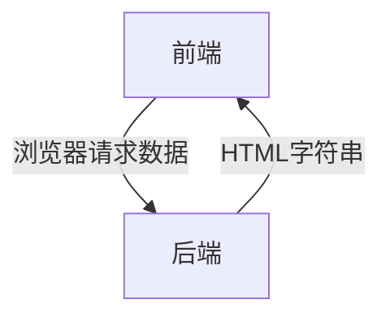
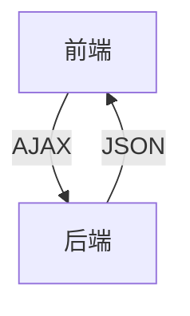

# 1. 项目简介(略)

# 2. 开发模式

## 2.1 前后端混合开发模式

所有HTML代码和数据在服务器端拼接好,一次性将所有内容发送到客户端,浏览器执行代码,将内容呈现给用户

问题:

1.前后端开发人员对互相的代码都不是特别熟悉,混合开发两者在处理相互的代码时非常困难

2.在开发的过程中难免会出现代码相互覆盖,导致工作量倍增

## 2.2 前后端分离开发模式

好处: 职责、分工明确、独立开发,互补影响

# 3. 项目架构

| 系统分层 | 使用技术                                                     |
| :------- | :----------------------------------------------------------- |
| 数据层   | mongoDB                                                      |
| 服务层   | node.js(express)                                             |
| 客户端   | art-template、jQuery、font-awesome(字符图标库)、swipe(轮播图) |

# 4. 项目运行环境搭建(略)

741